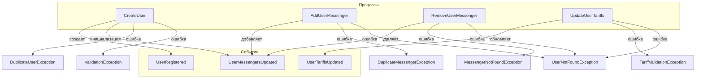

# Диаграмма взаимодействия процессов и событий Account Context

## Диаграмма (conceptual)

## Описание

- Процессы инициируют события, отражающие изменения в домене.
- Исключения выбрасываются при нарушении инвариантов или бизнес-правил.
- Все события и ошибки связаны с конкретными процессами.

## Связанные документы

* [Account Context Overview](../overview.md)
* [Процессы](../processes/overview.md)
* [События](../events/overview.md)
* [Исключения](../exceptions/overview.md)
