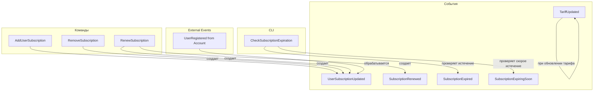

# Обзор событий Billing Context

## Основные события

| Событие | Описание | Файл |
| ------- | -------- | ---- |
| **TariffUpdated** | При изменении параметров тарифа или его опций | [tariff-updated-event.md](tariff-updated-event.md) |
| **UserSubscriptionUpdated** | При добавлении или удалении подписки | [user-subscription-updated-event.md](user-subscription-updated-event.md) |
| **SubscriptionRenewed** | При продлении подписки | [subscription-renewed-event.md](subscription-renewed-event.md) |
| **SubscriptionExpired** | Когда подписка истекла | [subscription-expired-event.md](subscription-expired-event.md) |
| **SubscriptionExpiringSoon** | За 7, 3 или 1 день до истечения | [subscription-expiring-soon-event.md](subscription-expiring-soon-event.md) |

## Структура событий

```
docs/backend/billing/events/
├── overview.md                                # Этот файл (оглавление)
├── tariff-updated-event.md                    # Спецификация события
├── user-subscription-updated-event.md         # Спецификация события
├── subscription-renewed-event.md              # Спецификация события (NEW)
├── subscription-expired-event.md              # Спецификация события
└── subscription-expiring-soon-event.md        # Спецификация события
```

## Диаграмма событий



## События по категориям

### Tariff Events

- **TariffUpdated**: При изменении параметров тарифа или его опций

### Subscription Events

- **UserSubscriptionUpdated**: При добавлении/удалении подписки (с action: ADDED/REMOVED)
- **SubscriptionRenewed**: При продлении подписки (создаётся новая подписка с ссылкой на предыдущую)
- **SubscriptionExpired**: При истечении подписки
- **SubscriptionExpiringSoon**: За 7/3/1 день до истечения

## Внешние события (из других контекстов)

| Событие | Контекст | Обработчик |
| ------- | -------- | ---------- |
| **UserRegistered** | Account | [UserRegisteredEventHandler](../handlers/user-registered-event-handler.md) |

## Все события наследуют от DomainEventInterface (Shared Context)

Каждое событие содержит:

- `eventId` — уникальный идентификатор события
- `aggregateId` — идентификатор агрегата
- `aggregateType` — тип агрегата (Tariff, UserSubscription)
- `eventName` — имя события
- `occurredAt` — время события
- `payload` — специфичные данные события

## Связанные документы

* [Billing Context Overview](../overview.md)
* [Модели](../models/overview.md)
* [Исключения](../exceptions/overview.md)
* [Event Handlers](../handlers/user-registered-event-handler.md)
