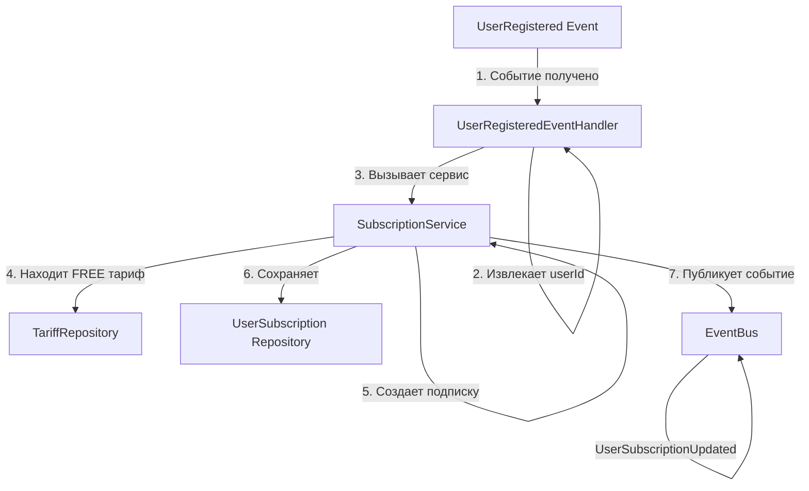

# UserRegisteredEventHandler

## Описание

Обработчик события `UserRegistered` из Account Context. При регистрации нового пользователя автоматически создаёт бессрочную FREE подписку.

## Расположение

```
src/Context/Billing/Application/Event/UserRegisteredEventHandler.php
```

## Входящее событие

Слушает событие из **Account Context**:

```php
App\Context\Account\Domain\Event\UserRegistered
{
    eventId: string,
    aggregateId: string (userId),
    aggregateType: 'User',
    eventName: 'UserRegistered',
    occurredAt: DateTimeImmutable,
    payload: {
        userId: string,
        email: string,
        messengerType: string,
        messengerId: string
    }
}
```

## Логика обработки



## Пошаговое описание

```
1. Получает событие UserRegistered
    ↓
2. Извлекает userId из payload
    ↓
3. Вызывает SubscriptionService::createFreeSubscription(userId)
    ↓
4. Сервис находит FREE тариф из репозитория
    ↓
5. Сервис создает UserSubscription:
   - tariff = FREE
   - period = null (бессрочная)
   - validUntil = null
   - status = ACTIVE
    ↓
6. Сохраняет подписку в БД
    ↓
7. Публикует событие UserSubscriptionUpdated (action: ADDED)
```

## Интерфейс

```php
namespace App\Context\Billing\Application\Event;

use App\Context\Account\Domain\Event\UserRegistered;
use App\Context\Billing\Application\Service\SubscriptionService;
use App\Context\Shared\Domain\Model\UserId;

final class UserRegisteredEventHandler
{
    public function __construct(
        private readonly SubscriptionService $subscriptionService,
    ) {}

    public function __invoke(UserRegistered $event): void
    {
        $userId = UserId::fromString($event->getUserId());

        $this->subscriptionService->createFreeSubscription($userId);
    }
}
```

## Гарантии

**Idempotent**: Повторный вызов не создаст дублирующуюся подписку (сервис проверяет наличие)
**Async-safe**: Может обрабатываться асинхронно через очередь сообщений
**Fault-tolerant**: Если FREE тариф не найден — выбрасывает исключение (критическая ошибка конфигурации)

## Исключения

| Исключение | Условие | Действие |
|-----------|---------|---------|
| **TariffNotFoundException** | FREE тариф не существует в БД | Логирует критическую ошибку |
| **DuplicateSubscriptionException** | У пользователя уже есть FREE подписка | Игнорирует (идемпотентность) |

## Конфигурация Symfony Messenger

```yaml
# config/packages/messenger.yaml
framework:
    messenger:
        routing:
            'App\Context\Account\Domain\Event\UserRegistered':
                - async  # или sync, в зависимости от требований
```

## Статус реализации

- [ ] Класс Handler создан
- [ ] Подписка на событие настроена
- [ ] Метод createFreeSubscription добавлен в SubscriptionService
- [ ] Идемпотентность проверена
- [ ] Unit тесты написаны (5+ тестов)
- [ ] Integration тесты пройдены
- [ ] Конфигурация Messenger добавлена
- [ ] Документация актуальна

## Связанные сущности

- [SubscriptionService](../services/subscription-service.md)
- [UserSubscription Aggregate Root](../models/user-subscription-aggregate-root.md)
- [Account Context: UserRegistered Event](../../account/events/user-registered-event.md)
- [Billing Context Overview](../overview.md)
