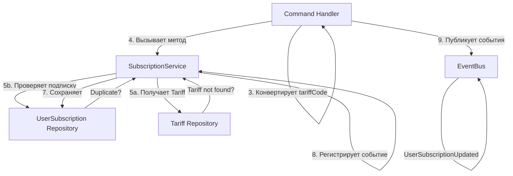

# Процесс: AddUserSubscription (Добавление подписки)

## Описание

Процесс добавления новой подписки для пользователя. Гарантирует, что пользователь не может иметь две активные подписки на один и тот же тариф.

## Диаграмма взаимодействия



## Пошаговое описание

### Шаг 1-3: Command Handler (валидация и конвертация)

```
AddUserSubscription(userId: string, tariffCode: string)
    ↓
Валидирует входные данные (не пусто)
    ↓
Конвертирует tariffCode (string) → Tariff enum (из Shared Context)
    ↓
Если невалидный код → выбрасывает InvalidTariffException
```

### Шаг 4-8: SubscriptionService (бизнес-логика)

```
addSubscription(userId: UserId, tariff: Tariff): UserSubscription
    ↓
1. Получает Tariff по коду из репозитория
   → Если не найден: выбрасывает TariffNotFoundException
    ↓
2. Проверяет, есть ли уже активная подписка пользователя на этот тариф
   → Если да: выбрасывает DuplicateSubscriptionException
    ↓
3. Создает новый объект UserSubscription
   - subscriptionId = UserSubscriptionId::generate()
   - status = ACTIVE
   - createdAt = now
    ↓
4. Сохраняет подписку в базе данных (репозиторий)
    ↓
5. Регистрирует событие UserSubscriptionUpdated (action: ADDED) в агрегате
    ↓
6. Возвращает созданный UserSubscription
```

### Шаг 9: Command Handler получает результат

```
SubscriptionService возвращает UserSubscription
    ↓
Subscription уже сохранена в БД
    ↓
События уже опубликованы через EventBus (в сервисе)
    ↓
Command Handler просто возвращает результат
```

## Исключения

| Исключение | Условие | Действие |
|-----------|---------|---------|
| **InvalidTariffException** | Код тарифа невалидный | Command Handler ловит, возвращает ошибку клиенту |
| **TariffNotFoundException** | Тариф не существует | SubscriptionService выбрасывает |
| **DuplicateSubscriptionException** | Подписка уже существует | SubscriptionService выбрасывает |

## Гарантии

**Атомарность**: Если метод вернул результат без исключения, подписка сохранена в БД и событие зарегистрировано
**Консистентность**: Невозможна дублирующаяся подписка благодаря проверке в сервисе
**Окончательность**: После вызова сервиса данные полностью сохранены

## Связанные документы

- [SubscriptionService](../services/subscription-service.md)
- [UserSubscription Model](../models/user-subscription-aggregate-root.md)
- [Processes Overview](./overview.md)
