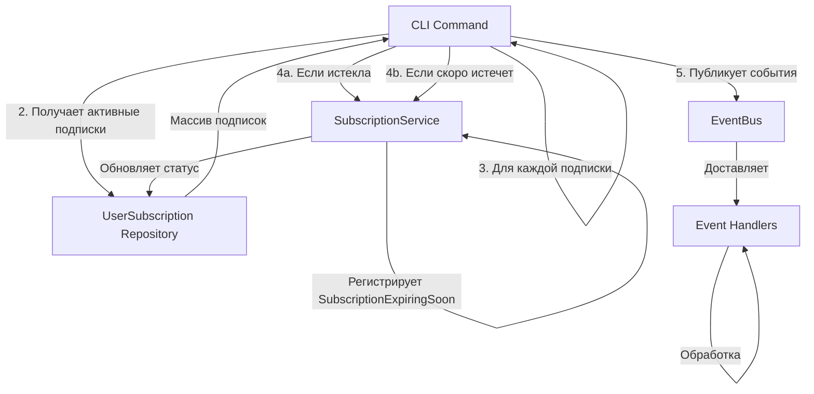

# Процесс: CheckSubscriptionExpiration (Проверка истечения подписок)

## Описание

CLI процесс для периодической проверки статуса подписок. Обнаруживает истекшие подписки и отправляет предупреждения о скором истечении. Обычно запускается через Cron/Scheduler.

## Диаграмма взаимодействия



## Пошаговое описание

### Шаг 1-2: Получение данных

```
CLI: billing:check-subscription-expiration
    ↓
Получает ВСЕ активные подписки из репозитория
    ↓
Для каждой подписки: UserSubscription { status: ACTIVE, validUntil: DateTimeImmutable }
```

### Шаг 3-4: Проверка статуса

```
ДЛЯ КАЖДОЙ подписки:

├─ Если validUntil == null
│  └─ Пропускает (бесконечная подписка)
│
├─ Если validUntil < now()
│  └─ ИСТЕКЛА ПОДПИСКА
│     ├─ Обновляет статус: status = EXPIRED
│     ├─ Сохраняет в репозиторий
│     └─ Регистрирует событие: SubscriptionExpired
│
└─ Если validUntil > now()
   ├─ Вычисляет: daysUntilExpiration = (validUntil - now()).days
   │
   └─ Если daysUntilExpiration == 7 ИЛИ 3 ИЛИ 1
      ├─ СКОРО ИСТЕЧЕТ
      ├─ Регистрирует событие: SubscriptionExpiringSoon
      │  с параметром daysUntilExpiration
      └─ НЕ обновляет статус (остается ACTIVE)
```

*Примечание* 

- Параметры daysUntilExpiration (7 ИЛИ 3 ИЛИ 1) должны быть настраиваемыми

### Шаг 5: Публикация событий

```
Собирает все события от всех подписок
    ↓
Публикует их через EventBus (batch или по одному)
    ↓
Обработчики событий получают и обрабатывают:
├─ SubscriptionExpiredEventHandler
└─ SubscriptionExpiringsSoonEventHandler
```

*Примечание* 

- Событие `SubscriptionExpiringsSoonEventHandler` публикует 1 раз для подписки, например при выполнении процедуры дважды за короткий промежуток времени событие SubscriptionExpiringsSoonEventHandler(7 days) будет отправленно 1 раз, следующая отправка будет SubscriptionExpiringsSoonEventHandler(3 days) и тд

## События

### SubscriptionExpired

**Когда**: Подписка истекла (validUntil <= now)

**Payload**:
```php
SubscriptionExpired {
    subscriptionId: UserSubscriptionId,
    userId: UserId,
    tariff: Tariff,
    expiredAt: DateTimeImmutable
}
```

**Обработчик**:
- Обновляет статус в БД (если еще не обновлен)
- Отправляет уведомление пользователю
- Синхронизирует с Account Context

### SubscriptionExpiringSoon

**Когда**: Подписка истечет через 7, 3 или 1 день

**Payload**:
```php
SubscriptionExpiringSoon {
    subscriptionId: UserSubscriptionId,
    userId: UserId,
    tariff: Tariff,
    daysUntilExpiration: int,      // 7, 3 или 1
    expiresAt: DateTimeImmutable
}
```

**Обработчик**:
- Отправляет уведомление пользователю
- Может предложить продление подписки

## Пример вывода CLI

```bash
$ bin/console billing:check-subscription-expiration

Checking subscriptions...
Found 125 active subscriptions.

Processing subscriptions:
- Subscription 550e8400-e29b-41d4-a716-446655440000: EXPIRED
- Subscription 6ba7b810-9dad-11d1-80b4-00c04fd430c8: EXPIRING in 7 days
- Subscription 6ba7b811-9dad-11d1-80b4-00c04fd430c8: EXPIRING in 3 days
- ...

Published events:
- 15 SubscriptionExpired events
- 8 SubscriptionExpiringSoon(7 days) events
- 12 SubscriptionExpiringSoon(3 days) events
- 5 SubscriptionExpiringSoon(1 day) events

Done!
```

## Cron настройка

```bash
# Проверка каждый день в 00:00 UTC
0 0 * * * /app/bin/console billing:check-subscription-expiration

# Или несколько раз в день (например, 4 раза)
0 0,6,12,18 * * * /app/bin/console billing:check-subscription-expiration
```

## Гарантии

**Idempotent**: Можно запустить несколько раз за день - не будут дублированы события
**Atomic**: Каждая подписка обрабатывается как отдельная единица
**Robust**: Если одна подписка вызовет ошибку, остальные продолжат обрабатываться

## Связанные документы

- [SubscriptionExpired Event](../events/subscription-expired-event.md)
- [SubscriptionExpiringSoon Event](../events/subscription-expiring-soon-event.md)
- [UserSubscription Model](../models/user-subscription-aggregate-root.md)
- [Processes Overview](./overview.md)
