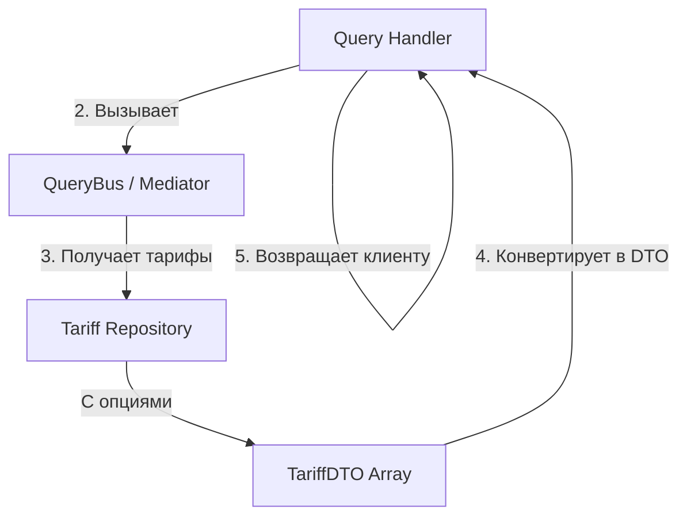

# Процесс: GetTariffList (Получение списка тарифов)

## Описание

Query процесс для получения списка всех доступных тарифов с их опциями. Используется для отображения информации о тарифах клиентам.

## Диаграмма взаимодействия



## Пошаговое описание

```
GetTariffList()
    ↓
1. Query Handler получает запрос (без параметров)
    ↓
2. Получает все тарифы из репозитория
   - Загружает Tariff агрегаты с их TariffOption'ами
    ↓
3. Конвертирует доменные модели в Data Transfer Objects (DTO)
   ```
   Tariff (domain model)
       ├── code: Tariff
       ├── name: string
       ├── priority: int
       ├── price: decimal
       └── options: array<TariffOption>
           ├── code: string
           ├── name: string
           ├── type: TariffOptionType
           └── value: mixed
    ↓
   TariffDTO (response)
       ├── code: string (value of enum)
       ├── name: string
       ├── priority: int
       ├── price: string
       └── options: array<OptionDTO>
   ```
    ↓
4. Возвращает массив TariffDTO
```

## Выход (Response)

```json
{
  "tariffs": [
    {
      "code": "FREE",
      "name": "Free Plan",
      "priority": 0,
      "price": "0.00",
      "options": [
        {
          "code": "MAX_GROUPS",
          "name": "Maximum Groups",
          "type": "MAX_CONSTRAINT",
          "value": 5
        }
      ]
    },
    {
      "code": "PRO",
      "name": "Professional",
      "priority": 1,
      "price": "29.99",
      "options": [...]
    }
  ]
}
```

## Особенности

**Быстрый доступ**: Не требует валидации или конвертации параметров
**Кэшируемый**: Результат может быть закэширован на клиенте или в прокси
**No Side Effects**: Процесс только читает данные, не изменяет состояние

## Исключения

Этот процесс обычно не выбрасывает исключений (считается, что тарифы всегда существуют).

## Связанные документы

- [Tariff Model](../models/tariff-aggregate-root.md)
- [TariffOption Model](../models/tariff-option-value-object.md)
- [Processes Overview](./overview.md)
