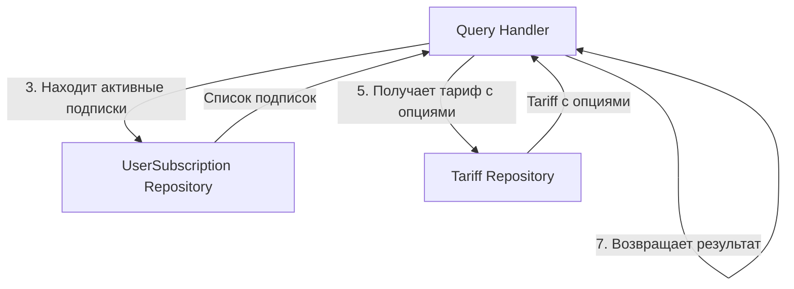

# Процесс: GetUserLimits (Получение лимитов пользователя)

## Описание

Query процесс для получения всех лимитов (опций тарифов) доступных пользователю. Агрегирует опции из всех активных подписок пользователя и возвращает объединённый результат.

Используется другими контекстами (Bot, Shared) для проверки прав доступа пользователя.

## Диаграмма взаимодействия



## Пошаговое описание

```
GetUserLimits(userId: string)
    ↓
1. Конвертирует userId (string) → UserId
    ↓
2. Получает все активные подписки пользователя из репозитория
    ↓
3. Для каждой подписки:
   - Получает Tariff по tariffId
   - Получает все TariffOption этого тарифа
    ↓
4. Агрегирует опции:
   - Для MAX_CONSTRAINT: берёт максимальное значение среди всех тарифов
   - Для BOOL: true если хотя бы в одном тарифе true
   - Для TEXT: берёт значение из тарифа с наивысшим приоритетом
    ↓
5. Возвращает array<optionCode => value>
```

## Query

```php
namespace App\Context\Billing\Application\Query;

final class GetUserLimitsQuery
{
    public function __construct(
        public readonly string $userId,
    ) {}
}
```

## Query Handler

```php
namespace App\Context\Billing\Application\Query;

use App\Context\Billing\Domain\Repository\UserSubscriptionRepositoryInterface;
use App\Context\Billing\Domain\Repository\TariffRepositoryInterface;
use App\Context\Shared\Domain\Model\UserId;

final class GetUserLimitsQueryHandler
{
    public function __construct(
        private readonly UserSubscriptionRepositoryInterface $subscriptionRepository,
        private readonly TariffRepositoryInterface $tariffRepository,
    ) {}

    /**
     * @return array<string, mixed> Ассоциативный массив [optionCode => value]
     */
    public function handle(GetUserLimitsQuery $query): array
    {
        $userId = UserId::fromString($query->userId);
        $subscriptions = $this->subscriptionRepository->findActiveByUserId($userId);

        if (empty($subscriptions)) {
            return [];
        }

        $limits = [];
        $tariffPriorities = [];

        foreach ($subscriptions as $subscription) {
            $tariff = $this->tariffRepository->findById($subscription->getTariffId());

            if ($tariff === null) {
                continue;
            }

            foreach ($tariff->getOptions() as $option) {
                $code = $option->getCode();
                $value = $option->getValue();
                $type = $option->getType();
                $priority = $tariff->getPriority();

                $this->aggregateOption($limits, $tariffPriorities, $code, $value, $type, $priority);
            }
        }

        return $limits;
    }

    private function aggregateOption(
        array &$limits,
        array &$priorities,
        string $code,
        mixed $value,
        TariffOptionType $type,
        int $priority
    ): void {
        if (!isset($limits[$code])) {
            $limits[$code] = $value;
            $priorities[$code] = $priority;
            return;
        }

        match ($type) {
            TariffOptionType::MAX_CONSTRAINT => $limits[$code] = max($limits[$code], $value),
            TariffOptionType::BOOL => $limits[$code] = $limits[$code] || $value,
            TariffOptionType::TEXT => {
                if ($priority > $priorities[$code]) {
                    $limits[$code] = $value;
                    $priorities[$code] = $priority;
                }
            },
        };
    }
}
```

## Результат

```php
// Пример результата для пользователя с FREE + PRO подписками
[
    'MAX_GROUPS' => 50,          // MAX из FREE(5) и PRO(50)
    'MAX_CHANNELS' => 100,       // MAX из FREE(10) и PRO(100)
    'CAN_EXPORT' => true,        // true, т.к. PRO имеет эту опцию
    'SUPPORT_LEVEL' => 'priority' // TEXT из PRO (выше приоритет)
]
```

## Логика агрегации опций

| Тип опции | Логика агрегации | Пример |
|-----------|-----------------|--------|
| **MAX_CONSTRAINT** | Берётся максимальное значение | FREE(5) + PRO(50) = 50 |
| **BOOL** | true если хотя бы в одном true | FREE(false) + PRO(true) = true |
| **TEXT** | Значение из тарифа с наивысшим приоритетом | FREE("basic") + PRO("priority") = "priority" |

## Использование в других контекстах

```php
// В Shared или Bot контексте
$limits = $this->queryBus->handle(new GetUserLimitsQuery($userId));

// Проверка лимита
$maxGroups = $limits['MAX_GROUPS'] ?? 0;
if ($currentGroupsCount >= $maxGroups) {
    throw new LimitExceededException('MAX_GROUPS');
}
```

## Статус реализации

- [ ] Query создан
- [ ] Query Handler реализован
- [ ] Логика агрегации реализована
- [ ] Unit тесты написаны (8+ тестов)
- [ ] Integration тесты пройдены
- [ ] Сервис зарегистрирован в QueryBus

## Связанные документы

- [UserSubscriptionRepository](../infrastructure/user-subscription-repository.md)
- [TariffRepository](../infrastructure/tariff-repository.md)
- [TariffOption Value Object](../models/tariff-option-value-object.md)
- [GetTariffList Process](./get-tariff-list-process.md)
- [Processes Overview](./overview.md)
