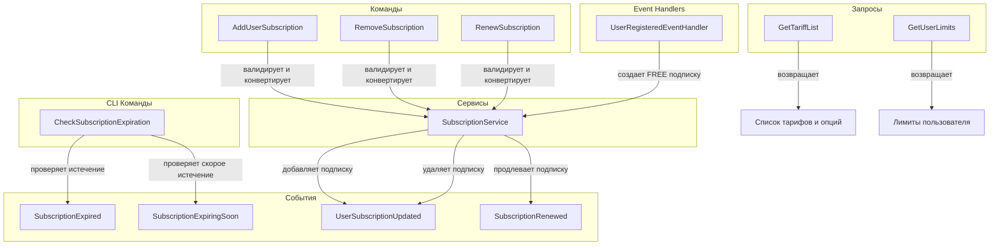

# Обзор процессов Billing Context

## Диаграмма взаимодействия процессов и событий

## Процессы

### 1. [AddUserSubscription — Добавление подписки](add-user-subscription-process.md)

Процесс добавления новой подписки для пользователя.

**Команда**: `AddUserSubscription(userId, tariffCode, period)`

**Результат**: ✅ Создана новая подписка, опубликовано событие `UserSubscriptionUpdated`

**Исключения**: InvalidTariffException, TariffNotFoundException, DuplicateSubscriptionException

---

### 2. [RenewSubscription — Продление подписки](renew-subscription-process.md)

Процесс продления подписки пользователя. Создаёт новую подписку с ссылкой на предыдущую.

**Команда**: `RenewSubscription(userId, tariffCode, period)`

**Результат**: ✅ Создана новая подписка, опубликованы события `SubscriptionRenewed` и `UserSubscriptionUpdated`

**Исключения**: InvalidTariffException, TariffNotFoundException, SubscriptionNotFoundException

---

### 3. [RemoveSubscription — Удаление подписки](remove-subscription-process.md)

Процесс удаления подписки пользователя на определенный тариф.

**Команда**: `RemoveSubscription(userId, tariffCode)`

**Результат**: ✅ Удалена подписка, опубликовано событие `UserSubscriptionUpdated`

**Исключения**: InvalidTariffException, TariffNotFoundException, SubscriptionNotFoundException

---

### 4. [GetTariffList — Получение списка тарифов](get-tariff-list-process.md)

Query процесс для получения всех доступных тарифов с их опциями.

**Query**: `GetTariffList()`

**Результат**: ✅ Список всех доступных тарифов

**Исключения**: Нет (всегда возвращает результат)

---

### 5. [GetUserLimits — Получение лимитов пользователя](get-user-limits-process.md)

Query процесс для получения агрегированных лимитов пользователя из всех его активных подписок.

**Query**: `GetUserLimits(userId)`

**Результат**: ✅ Ассоциативный массив `[optionCode => value]`

**Использование**: Другие контексты (Bot, Shared) для проверки прав доступа

**Исключения**: Нет (возвращает пустой массив если нет подписок)

---

### 6. [CheckSubscriptionExpiration — Проверка истечения](check-subscription-expiration-process.md)

CLI процесс для периодической проверки статуса подписок (обычно Cron).

**CLI Команда**: `billing:check-subscription-expiration`

**Результат**: ✅ Опубликованы события `SubscriptionExpired` и `SubscriptionExpiringSoon`

**Частота**: Рекомендуется запускать 1-4 раза в день

---

## Event Handlers

### [UserRegisteredEventHandler](../handlers/user-registered-event-handler.md)

Обработчик события `UserRegistered` из Account Context.

**Слушает**: `UserRegistered` (Account Context)

**Действие**: Создаёт бессрочную FREE подписку для нового пользователя

---

## Архитектурные принципы

### SubscriptionService гарантирует:

✅ **Полное сохранение**: Все изменения сохранены в БД после вызова метода

✅ **Регистрация событий**: Все события зарегистрированы в агрегатах

✅ **Атомарность**: Либо действие полностью выполнено, либо выброшено исключение

✅ **Окончательность**: После вызова сервиса состояние зафиксировано

### Command Handlers отвечают только за:

1️⃣ Валидацию входных параметров

2️⃣ Конвертацию типов (string → enum и т.д.)

3️⃣ Делегирование логики в SubscriptionService

### Event Handlers (в других контекстах) обрабатывают:

- Отправку уведомлений (Notifications Context)
- Синхронизацию с другими контекстами
- Логирование и аналитику

---

## Связанные документы

* [Billing Context Overview](../overview.md)
* [SubscriptionService](../services/subscription-service.md)
* [События](../events/overview.md)
* [Исключения](../exceptions/overview.md)
* [Модели](../models/overview.md)
* [REST API](../api/endpoints.md)
