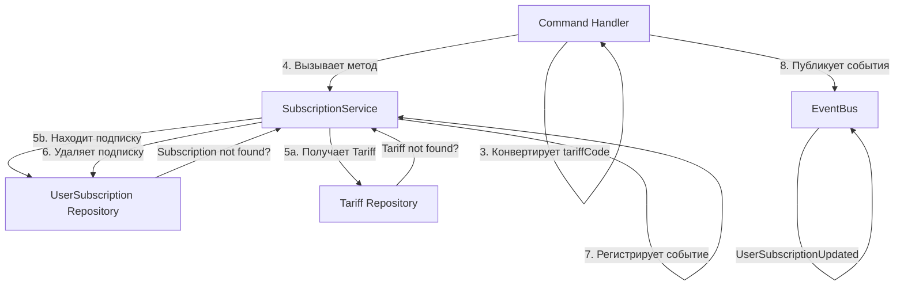

# Процесс: RemoveSubscription (Удаление подписки)

## Описание

Процесс удаления подписки пользователя. Позволяет пользователю отменить свою подписку на определенный тариф.

## Диаграмма взаимодействия



## Пошаговое описание

### Шаг 1-3: Command Handler (валидация и конвертация)

```
RemoveSubscription(userId: string, tariffCode: string)
    ↓
Валидирует входные данные (не пусто)
    ↓
Конвертирует tariffCode (string) → Tariff enum (из Shared Context)
    ↓
Если невалидный код → выбрасывает InvalidTariffException
```

### Шаг 4-7: SubscriptionService (бизнес-логика)

```
removeSubscription(userId: UserId, tariff: Tariff): void
    ↓
1. Получает Tariff по коду из репозитория
   → Если не найден: выбрасывает TariffNotFoundException
    ↓
2. Находит активную подписку пользователя для этого тарифа
   → Если не найдена: выбрасывает SubscriptionNotFoundException
    ↓
3. Удаляет подписку из базы данных (репозиторий)
    ↓
4. Регистрирует событие UserSubscriptionUpdated (action: REMOVED) в агрегате
    ↓
5. Возвращает void
```

### Шаг 8: Command Handler получает результат

```
SubscriptionService завершает работу
    ↓
Subscription обновлена в БД (status = CANCELLED)
    ↓
События уже опубликованы через EventBus (в сервисе)
    ↓
Command Handler получает управление обратно
```

## Исключения

| Исключение | Условие | Действие |
|-----------|---------|---------|
| **InvalidTariffException** | Код тарифа невалидный | Command Handler ловит, возвращает ошибку клиенту |
| **TariffNotFoundException** | Тариф не существует | SubscriptionService выбрасывает |
| **SubscriptionNotFoundException** | Подписка не найдена | SubscriptionService выбрасывает |

## Гарантии

**Атомарность**: Если метод вернул без исключения, подписка удалена из БД и событие зарегистрировано
**Безопасность**: Невозможно удалить уже удаленную подписку (выбросится исключение)
**Окончательность**: После вызова сервиса изменения полностью сохранены

## Связанные документы

- [SubscriptionService](../services/subscription-service.md)
- [UserSubscription Model](../models/user-subscription-aggregate-root.md)
- [Processes Overview](./overview.md)
