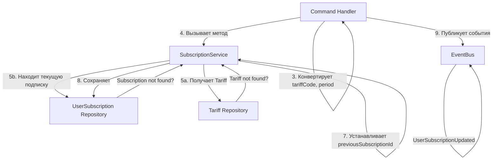

# Процесс: RenewSubscription (Продление подписки)

## Описание

Процесс продления подписки пользователя. При продлении создаётся **новая подписка** с тем же тарифом, а старая подписка остаётся с прежним сроком действия. Новая подписка ссылается на предыдущую через `previousSubscriptionId`.

## Диаграмма взаимодействия



## Пошаговое описание

### Шаг 1-3: Command Handler (валидация и конвертация)

```
RenewSubscription(userId: string, tariffCode: string, period: string)
    ↓
Валидирует входные данные (не пусто)
    ↓
Конвертирует tariffCode (string) → Tariff enum
    ↓
Конвертирует period (string) → SubscriptionPeriod enum
    ↓
Если невалидный код → выбрасывает InvalidTariffException
Если невалидный период → выбрасывает InvalidSubscriptionPeriodException
```

### Шаг 4-8: SubscriptionService (бизнес-логика)

```
renewSubscription(userId: UserId, tariff: Tariff, period: SubscriptionPeriod): UserSubscription
    ↓
1. Получает Tariff по коду из репозитория
   → Если не найден: выбрасывает TariffNotFoundException
    ↓
2. Находит активную подписку пользователя на этот тариф
   → Если не найдена: выбрасывает SubscriptionNotFoundException
    ↓
3. Создает НОВЫЙ объект UserSubscription с:
   - subscriptionId = UserSubscriptionId::generate()
   - period = переданный период
   - validUntil = now + period
   - status = ACTIVE
   - previousSubscriptionId = id текущей подписки
    ↓
4. Регистрирует событие SubscriptionRenewed в агрегате
    ↓
5. Сохраняет новую подписку в базе данных
    ↓
6. Публикует события через EventBus
    ↓
7. Возвращает созданную подписку
```

### Шаг 9: Публикация событий

```
SubscriptionService публикует события:
    ↓
├─ SubscriptionRenewed (основное событие продления)
└─ UserSubscriptionUpdated (action: ADDED) — для новой подписки

Старая подписка НЕ изменяется, остаётся активной до своего validUntil
```

## Команда

```php
class RenewSubscriptionCommand
{
    public function __construct(
        public readonly string $userId,
        public readonly string $tariffCode,
        public readonly string $period,  // 'MONTH' | 'YEAR'
    ) {}
}
```

## Исключения

| Исключение | Условие | Действие |
|-----------|---------|---------|
| **InvalidTariffException** | Код тарифа невалидный | Command Handler выбрасывает |
| **InvalidSubscriptionPeriodException** | Код периода невалидный | Command Handler выбрасывает |
| **TariffNotFoundException** | Тариф не существует | SubscriptionService выбрасывает |
| **SubscriptionNotFoundException** | Нет активной подписки для продления | SubscriptionService выбрасывает |

## Гарантии

**Атомарность**: Если метод вернул результат без исключения, новая подписка сохранена
**Консистентность**: Старая подписка не изменяется
**Трассируемость**: Новая подписка ссылается на предыдущую через previousSubscriptionId
**Окончательность**: После вызова сервиса данные полностью сохранены

## Пример использования

```php
// В Command Handler
public function handle(RenewSubscriptionCommand $command): UserSubscription
{
    $userId = UserId::fromString($command->userId);
    $tariff = Tariff::fromCode($command->tariffCode);
    $period = SubscriptionPeriod::fromCode($command->period);

    return $this->subscriptionService->renewSubscription($userId, $tariff, $period);
}
```

## Статус реализации

- [ ] Command создан
- [ ] Command Handler реализован
- [ ] Метод в SubscriptionService реализован
- [ ] Событие SubscriptionRenewed создано
- [ ] Unit тесты написаны (8+ тестов)
- [ ] Integration тесты пройдены

## Связанные документы

- [SubscriptionService](../services/subscription-service.md)
- [UserSubscription Model](../models/user-subscription-aggregate-root.md)
- [SubscriptionPeriod Enum](../enums/subscription-period.md)
- [SubscriptionRenewed Event](../events/subscription-renewed-event.md)
- [Processes Overview](./overview.md)
