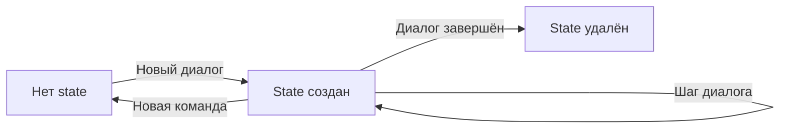

# ConversationState Model Specification

## Назначение

Доменная модель `ConversationState` хранит состояние активного диалога пользователя. Обеспечивает персистентность FSM между запросами и позволяет продолжить диалог с того места, где пользователь остановился.

`ConversationState` является Entity (не AggregateRoot, т.к. жизненный цикл привязан к диалогу).

## Атрибуты

| Поле               | Тип                    | Описание                                                    |
| ------------------ | ---------------------- | ----------------------------------------------------------- |
| `userId`           | `UserId`               | Идентификатор пользователя                                  |
| `messenger`        | `Messenger`            | Тип мессенджера (составная часть ключа)                     |
| `conversationCode` | `string`               | Код текущего диалога (start, help и т.д.)                   |
| `stepCode`         | `string`               | Код текущего шага в диалоге                                 |
| `contextData`      | `array`                | JSON данные контекста диалога                               |
| `updatedAt`        | `DateTimeImmutable`    | Дата последнего обновления                                  |

## Первичный ключ

Составной ключ: `(userId, messenger)`

Это гарантирует, что у пользователя может быть только один активный диалог на мессенджер.

## Методы

### static create(UserId $userId, Messenger $messenger, string $conversationCode, string $stepCode, array $contextData = []): self

Создание нового состояния диалога.

**Параметры**:
- `$userId` — идентификатор пользователя
- `$messenger` — тип мессенджера
- `$conversationCode` — код диалога
- `$stepCode` — начальный шаг
- `$contextData` — начальные данные контекста (опционально)

**Возвращает**: Новый объект `ConversationState`

---

### update(string $conversationCode, string $stepCode, array $contextData): void

Обновление состояния диалога.

**Логика**:
- Обновляет conversationCode, stepCode, contextData
- updatedAt = now

---

### updateStep(string $stepCode): void

Обновление только текущего шага.

---

### updateContextData(array $contextData): void

Обновление только данных контекста.

---

### Методы доступа

```php
public function getUserId(): UserId
public function getMessenger(): Messenger
public function getConversationCode(): string
public function getStepCode(): string
public function getContextData(): array
public function getUpdatedAt(): DateTimeImmutable
```

## Инварианты

- [x] ConversationState всегда связан с userId и messenger
- [x] Составной ключ (userId, messenger) уникален
- [x] Один активный диалог на пользователя и мессенджер
- [x] При завершении диалога state удаляется (не меняет статус)
- [x] updatedAt обновляется при любом изменении

## Репозиторий

**ConversationStateRepositoryInterface**

Методы:

* `find(UserId $userId, Messenger $messenger): ?ConversationState`
* `save(ConversationState $state): void`
* `delete(UserId $userId, Messenger $messenger): void`

## Жизненный цикл



## Связанные документы

* [Conversation](../conversations/abstract-conversation.md)
* [Router Service](../services/router.md)
* [Bot Context Overview](../overview.md)

## Статус реализации

* [ ] Класс ConversationState создан
* [ ] Методы create, update реализованы
* [ ] Интерфейс репозитория создан
* [ ] Doctrine Entity и Repository реализованы
* [ ] Unit тесты написаны
* [ ] Integration тесты пройдены
