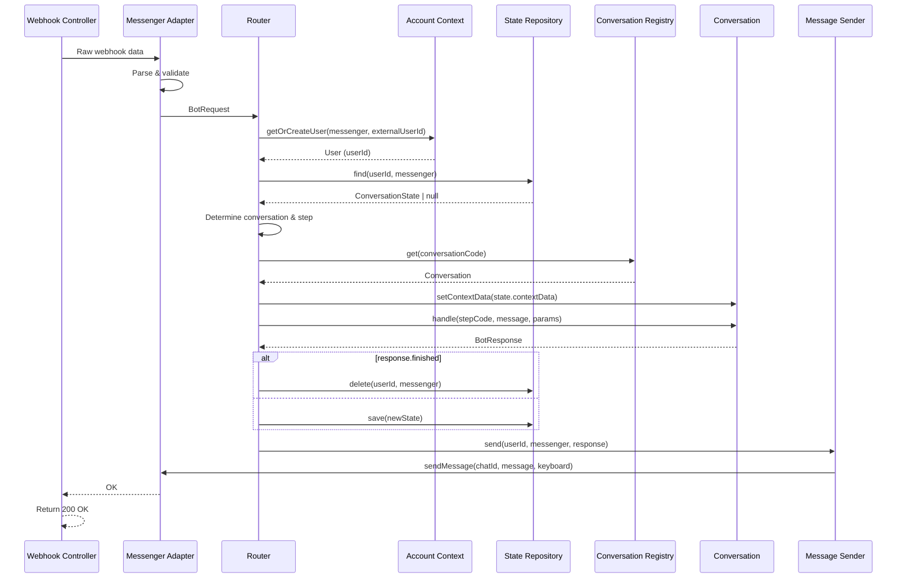

# Процесс: Handle Incoming Message

## Описание

Процесс обработки входящего сообщения от мессенджера. Это основной поток работы Bot Context.

## Диаграмма взаимодействия



## Пошаговое описание

### Шаг 1: Webhook получает данные

```
Telegram/WhatsApp/Discord → Webhook Controller
    ↓
Получение raw данных webhook
    ↓
Передача в соответствующий Messenger Adapter
```

### Шаг 2: Адаптер создает BotRequest

```
Messenger Adapter
    ↓
Парсинг специфичного для мессенджера формата
    ↓
Валидация данных
    ↓
Создание унифицированного BotRequest
```

### Шаг 3: Router обрабатывает запрос

```
Router::handle(BotRequest)
    ↓
1. AccountContext::getOrCreateUser()
   - Если новый → создание User, событие UserRegistered
   - Если существующий → получение userId
    ↓
2. Получение ConversationState из репозитория
    ↓
3. Определение conversation и step по логике:
   - Команда → conversationCode = command, сброс state
   - Команда с шагом → conversationCode + stepCode
   - Обычное сообщение → из state
   - Fallback → /help
    ↓
4. Получение Conversation из реестра
    ↓
5. Установка contextData в Conversation
    ↓
6. Вызов Conversation::handle()
```

### Шаг 4: Обработка ответа

```
BotResponse
    ↓
Если finished = true:
    → Удаление ConversationState
    → Очистка контекста

Если finished = false:
    → Сохранение нового state
    → conversationCode, stepCode, contextData
    ↓
Отправка сообщения через MessageSender
    ↓
Адаптер отправляет в мессенджер
```

### Шаг 5: Ответ webhook

```
Webhook Controller
    ↓
Return HTTP 200 OK
(подтверждение получения для мессенджера)
```

## Обработка ошибок

| Ситуация | Обработка |
|----------|-----------|
| Невалидный webhook | Вернуть 200 OK (не ретраить) |
| Conversation not found | Fallback на /help |
| User creation failed | Вернуть ошибку пользователю |
| Message send failed | Логировать, не ретраить |

## Связанные документы

* [Processes Overview](overview.md)
* [Router](../services/router.md)
* [BotRequest](../models/bot-request.md)
* [BotResponse](../models/bot-response.md)

## Статус реализации

* [ ] Webhook Controller создан
* [ ] Telegram Adapter реализован
* [ ] Router интегрирован
* [ ] State persistence работает
* [ ] Message sending работает
* [ ] Error handling настроен
* [ ] Integration тесты написаны
