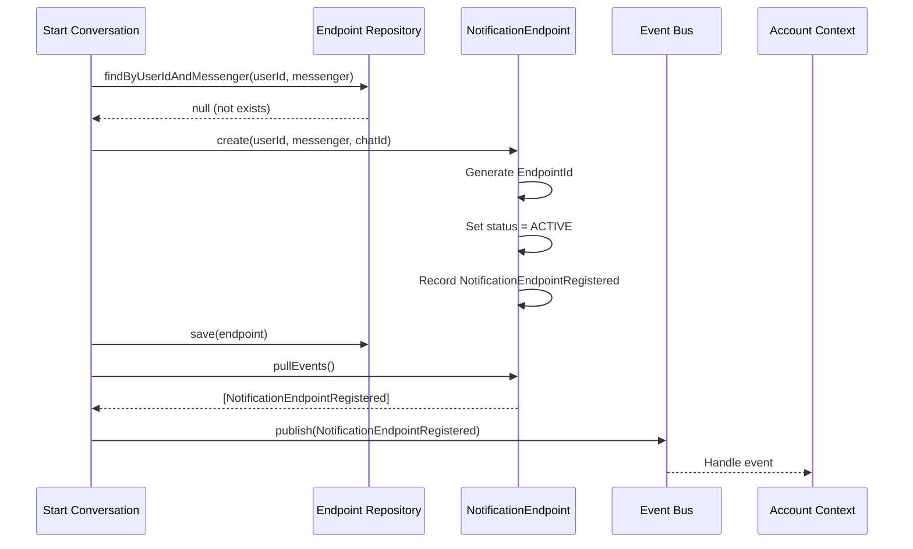

# Процесс: Register Endpoint

## Описание

Процесс регистрации NotificationEndpoint при первом подключении пользователя к боту.

## Диаграмма взаимодействия



## Пошаговое описание

### Шаг 1: Проверка существующего endpoint

```
StartConversation::stepStart()
    ↓
Проверка наличия endpoint:
    - endpointRepository->findByUserIdAndMessenger(userId, messenger)
    ↓
Если существует и активен:
    → Пропуск регистрации
    → Продолжение диалога

Если существует и отозван:
    → Создание нового endpoint

Если не существует:
    → Создание нового endpoint
```

### Шаг 2: Создание endpoint

```
NotificationEndpoint::create(userId, messenger, externalChatId)
    ↓
1. Генерация EndpointId (UUID)
2. Установка status = ACTIVE
3. createdAt = now()
4. Регистрация события NotificationEndpointRegistered
```

### Шаг 3: Сохранение и публикация события

```
endpointRepository->save(endpoint)
    ↓
endpoint->pullEvents()
    ↓
eventBus->publish(NotificationEndpointRegistered)
    ↓
Account Context получает событие
```

## Безопасность

**ВАЖНО**: externalChatId (chat_id) не включается в событие!

Событие содержит только:
- endpointId
- userId
- messenger
- occurredAt

## Связанные документы

* [Processes Overview](overview.md)
* [NotificationEndpoint](../models/notification-endpoint.md)
* [NotificationEndpointRegistered Event](../events/notification-endpoint-registered.md)
* [Start Conversation](../conversations/start-conversation.md)

## Статус реализации

* [ ] Логика в StartConversation реализована
* [ ] Интеграция с Endpoint Repository
* [ ] Событие публикуется
* [ ] Unit тесты написаны
