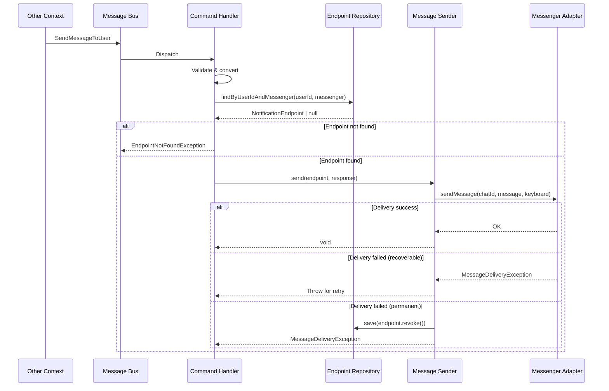

# Процесс: Send Message to User

## Описание

Процесс отправки сообщения пользователю по команде от других контекстов. Это публичный API Bot Context для исходящих сообщений.

## Команда

```php
final readonly class SendMessageToUser
{
    public function __construct(
        public string $userId,
        public string $messenger,
        public string $message,
        public ?array $keyboard = null,
    ) {}
}
```

## Диаграмма взаимодействия



## Пошаговое описание

### Шаг 1: Получение команды

```
Другой контекст (Account, Billing, Monitoring)
    ↓
Публикация команды SendMessageToUser в Message Bus
    ↓
Bot Context Command Handler получает команду
```

### Шаг 2: Валидация и поиск endpoint

```
Command Handler
    ↓
1. Валидация userId (UUID формат)
2. Конвертация messenger (string → Messenger enum)
    ↓
3. Поиск NotificationEndpoint:
   - endpointRepository->findByUserIdAndMessenger()
   - Если не найден → EndpointNotFoundException
   - Если revoked → EndpointNotFoundException
```

### Шаг 3: Отправка сообщения

```
MessageSender::send()
    ↓
1. Получение адаптера для мессенджера
2. Вызов adapter->sendMessage(chatId, message, keyboard)
    ↓
При успехе:
    → Логирование
    → Возврат

При ошибке:
    → Анализ типа ошибки
    → Если recoverable → повторная попытка (через retry policy)
    → Если permanent → отзыв endpoint, событие NotificationEndpointRevoked
```

## Гарантии

**Безопасность**: Другие контексты не получают доступ к chat_id
**Идемпотентность**: Повторная отправка безопасна
**Асинхронность**: Команда обрабатывается через Message Bus

## Пример использования

```php
// В Billing Context при скором истечении подписки
$this->messageBus->dispatch(new SendMessageToUser(
    userId: $subscription->getUserId()->getValue(),
    messenger: 'telegram',
    message: 'Ваша подписка истекает через 3 дня. Продлите сейчас!',
    keyboard: [
        [['text' => '📦 Продлить', 'action' => 'billing:renew']],
    ],
));
```

## Связанные документы

* [Processes Overview](overview.md)
* [MessageSender](../services/message-sender.md)
* [NotificationEndpoint](../models/notification-endpoint.md)

## Статус реализации

* [ ] Команда SendMessageToUser создана
* [ ] Command Handler реализован
* [ ] Интеграция с Message Bus
* [ ] Retry policy настроен
* [ ] Unit тесты написаны
