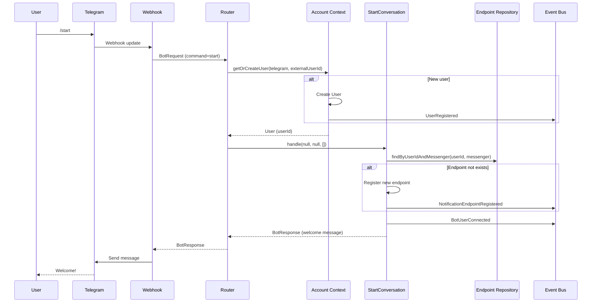

# Процесс: Start Conversation

## Описание

Процесс обработки команды /start — первичная инициализация пользователя в боте.

## Диаграмма взаимодействия



## Пошаговое описание

### Шаг 1: Получение /start

```
Пользователь нажимает Start в Telegram
    ↓
Telegram отправляет webhook update
    ↓
Webhook Controller получает данные
    ↓
Telegram Adapter создает BotRequest:
    - command = "start"
    - step = null
    - messenger = telegram
    - externalUserId = telegram_user_id
    - externalChatId = chat_id
```

### Шаг 2: Router обрабатывает

```
Router::handle(request)
    ↓
Сброс текущего state (команда /start)
    ↓
AccountContext::getOrCreateUser()
    ↓
Получение StartConversation из реестра
    ↓
Вызов handle(null, null, [])
```

### Шаг 3: StartConversation выполняет логику

```
StartConversation::stepStart()
    ↓
1. Регистрация endpoint (если не существует)
    - NotificationEndpoint::create()
    - Сохранение в репозиторий
    - Событие NotificationEndpointRegistered
    ↓
2. Генерация события BotUserConnected
    ↓
3. Формирование welcome message:
    - Приветствие
    - Кнопка WebApp (для Telegram)
    - Или ссылка с token (для других мессенджеров)
    ↓
4. Возврат BotResponse с finished=true
```

### Шаг 4: Отправка ответа

```
Router получает BotResponse
    ↓
State не сохраняется (finished=true)
    ↓
MessageSender отправляет сообщение
    ↓
Пользователь видит приветствие
```

## Формат welcome message

```php
$response = BotResponse::finishWithKeyboard(
    "👋 Добро пожаловать в Aivalone!\n\n" .
    "Я помогу вам настроить мониторинг Telegram-каналов.\n\n" .
    "Нажмите кнопку ниже, чтобы начать:",
    [
        [['text' => '🚀 Открыть приложение', 'action' => 'web_app:'. $webAppUrl]],
        [['text' => '❓ Помощь', 'action' => '/help']],
    ]
);
```

## Связанные документы

* [Processes Overview](overview.md)
* [Register Endpoint](register-endpoint.md)
* [Start Conversation](../conversations/start-conversation.md)
* [Router](../services/router.md)

## Статус реализации

* [ ] StartConversation создан
* [ ] Регистрация endpoint реализована
* [ ] WebApp button генерируется
* [ ] События публикуются
* [ ] Unit тесты написаны
* [ ] Integration тесты написаны
