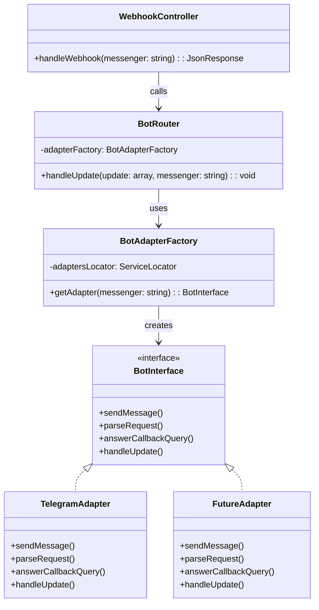

# Task #00007: Рефакторинг BotRouter для работы с BotInterface через фабрику

## Проблема

`BotRouter` жестко связан с конкретным классом `TelegramAdapter` вместо использования абстракции `BotInterface`. Это нарушает принцип инверсии зависимостей и усложняет добавление поддержки других мессенджеров.

## Текущая архитектура

- `BotInterface` - интерфейс для работы с ботом (уже существует)
- `TelegramAdapter` - реализует `BotInterface` (уже существует)
- `BotRouter` - использует `TelegramAdapter` напрямую через конструктор (нужно исправить)
- `WebhookService` - уже использует ServiceLocator для работы с адаптерами вебхуков (хороший паттерн для повторного использования)

## Решение

### 1. Создать фабрику для BotInterface адаптеров

**Файл:** `services/aivalone-backend/src/Context/Bot/Infrastructure/Messenger/BotAdapterFactory.php` (новый файл)

- Создать класс `BotAdapterFactory` с использованием `ServiceLocator` (аналогично `WebhookService`)
- Метод `getAdapter(string $messenger): BotInterface` для получения адаптера по коду мессенджера
- Обработка ошибок при отсутствии адаптера для указанного мессенджера

### 2. Изменить BotRouter для использования фабрики

**Файл:** `services/aivalone-backend/src/Context/Bot/Infrastructure/Messenger/BotRouter.php`

- Удалить зависимость `TelegramAdapter $adapter` из конструктора
- Добавить зависимость `BotAdapterFactory` в конструктор
- Изменить сигнатуру метода `handleUpdate()`: добавить параметр `string $messenger`
- В начале `handleUpdate()` получать адаптер через фабрику: `$adapter = $this->adapterFactory->getAdapter($messenger)`
- Заменить все использования `$this->adapter` на локальную переменную `$adapter` в методе `handleUpdate()` и всех приватных методах, которые его используют
- Обновить комментарий метода `handleUpdate()` - убрать упоминание "от Telegram"
- Проверить другие публичные методы, где используется $this->adapter и реализовать аналогичную логику, проверить вызов этих методов
- Перенести проверку telegramSecretToken из контроллера внутрь адаптера, у разных мессенджеров может быть свой pipeline для проверки оригинальности запроса.

### 3. Настроить ServiceLocator для BotInterface адаптеров

**Файл:** `services/aivalone-backend/config/services.yaml`

- Создать ServiceLocator `bot.adapters.locator` с привязкой `telegram` → `TelegramAdapter`
- Зарегистрировать `BotAdapterFactory` с зависимостью от ServiceLocator
- Удалить явную конфигурацию `BotRouter` (если была), так как autowiring справится

### 4. Обновить контроллер для передачи кода мессенджера

**Файл:** `services/aivalone-backend/src/Context/Bot/Presentation/Controller/WebhookController.php`

- Изменить роут: добавить параметр `{messenger}` в путь (например, `/webhook/{messenger}`)
- Или оставить `/webhook/telegram`, но извлекать код мессенджера из пути
- Передавать код мессенджера в `$this->botRouter->handleUpdate('telegram', $update)`
- Обновить комментарии, убрав упоминание только Telegram

## Диаграмма архитектуры после рефакторинга



## Преимущества

1. **Гибкость**: Легко добавить поддержку других мессенджеров - достаточно добавить новую реализацию `BotInterface` и новый роут
2. **Единообразие**: Используется тот же паттерн ServiceLocator, что и в `WebhookService`
3. **Тестируемость**: Можно использовать mock-объекты для тестирования
4. **Соответствие принципам SOLID**: Соблюдение Dependency Inversion Principle
5. **Масштабируемость**: При добавлении нового мессенджера не нужно менять `BotRouter`, только добавить адаптер и роут

## Изменения в файлах

### services/aivalone-backend/src/Context/Bot/Infrastructure/Messenger/BotAdapterFactory.php (новый)

```php
<?php

namespace App\Context\Bot\Infrastructure\Messenger;

use Psr\Container\ContainerInterface;

class BotAdapterFactory
{
    public function __construct(
        private ContainerInterface $adaptersLocator
    ) {
    }

    public function getAdapter(string $messenger): BotInterface
    {
        if (!$this->adaptersLocator->has($messenger)) {
            throw new \InvalidArgumentException(
                sprintf('Bot adapter for messenger "%s" not found. Available: %s', 
                    $messenger, 
                    implode(', ', array_keys($this->adaptersLocator->getServiceIds()))
                )
            );
        }

        return $this->adaptersLocator->get($messenger);
    }
}
```

### services/aivalone-backend/src/Context/Bot/Infrastructure/Messenger/BotRouter.php

- Удалить: `private TelegramAdapter $adapter` из конструктора
- Добавить: `private BotAdapterFactory $adapterFactory` в конструктор
- Изменить: `public function handleUpdate(array $update): void` → `public function handleUpdate(array $update, string $messenger): void`
- В начале `handleUpdate()`: `$adapter = $this->adapterFactory->getAdapter($messenger);`
- Заменить все `$this->adapter` на `$adapter` в методе и приватных методах

### services/aivalone-backend/config/services.yaml

- Добавить ServiceLocator:
```yaml
    # Bot Adapters Locator
    bot.adapters.locator:
        class: Symfony\Component\DependencyInjection\ServiceLocator
        arguments: !service_locator
            telegram: '@App\Context\Bot\Infrastructure\Messenger\TelegramAdapter'
```


### services/aivalone-backend/src/Context/Bot/Presentation/Controller/WebhookController.php

- Изменить вызов: `$this->botRouter->handleUpdate($update, 'telegram');`
- Обновить комментарии

## Примечания

- `getUserByTelegramId()` в `AccountPortInterface` остается специфичным для Telegram. Это отдельная задача для рефакторинга при добавлении других мессенджеров.
- При добавлении нового мессенджера (например, WhatsApp) нужно будет:

  1. Создать `WhatsAppAdapter implements BotInterface`
  2. Добавить в ServiceLocator: `whatsapp: '@App\Context\Bot\Infrastructure\Messenger\WhatsAppAdapter'`
  3. Добавить новый роут в контроллере: `/webhook/whatsapp`