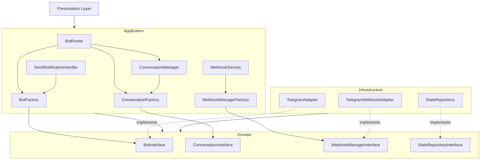

# Рефакторинг контекста Bot: Factory паттерн и объединение интерфейсов

## Проблемы

1. **Нарушение DDD**: Application слой зависит от Infrastructure
2. **Дублирование интерфейсов**: CommandConversationInterface и ConversationInterface разделены
3. **Несогласованность**: Использование классов вместо кодов для идентификации диалогов
4. **Смешение ответственности**: ServiceLocator'ы смешаны с бизнес-логикой

## Решение

### 1. Перенос BotInterface в Domain слой

**Файл:** `services/aivalone-backend/src/Context/Bot/Domain/Messenger/BotInterface.php` (новый)

- Создать интерфейс `BotInterface` в Domain слое
- Методы: `sendMessage()`, `parseRequest()`, `handleUpdate()`, `answerCallbackQuery()`, `validateRequest()`

**Файл:** `services/aivalone-backend/src/Context/Bot/Infrastructure/Messenger/BotInterface.php` (удалить)

### 2. Объединение CommandConversationInterface в ConversationInterface

**Файл:** `services/aivalone-backend/src/Context/Bot/Domain/Model/ConversationInterface.php` (обновить)

- Добавить методы из `CommandConversationInterface`:
  - `getCommand(): string` - возвращает команду (по умолчанию '/')
  - `getDescription(): string` - описание для справки
  - `requiresPermission(): bool` - требуется ли проверка прав
  - `getRequiredPermission(): ?string` - код права
- Заменить `getConversationClass(): string` на `getCode(): string` (обязательный метод, все диалоги имеют код)
- Добавить метод `getAvailableSteps(): array` - список доступных шагов

**Файл:** `services/aivalone-backend/src/Context/Bot/Domain/Model/CommandConversationInterface.php` (удалить)

### 3. Обновление AbstractConversation

**Файл:** `services/aivalone-backend/src/Context/Bot/Domain/Model/AbstractConversation.php` (обновить)

- Метод `getAvailableSteps()` сделать публичным (из интерфейса)
- Заменить `getConversationClass()` на `getCode()` (обязательный метод)
- Добавить реализацию методов:
  - `getCommand(): string` - возвращает '/' по умолчанию (переопределяется в дочерних классах)
  - `getDescription(): string` - возвращает пустую строку по умолчанию
  - `requiresPermission(): bool` - возвращает false по умолчанию
  - `getRequiredPermission(): ?string` - возвращает null по умолчанию

### 4. Обновление StateEntity

**Файл:** `services/aivalone-backend/src/Context/Bot/Domain/Model/StateEntity.php` (обновить)

- Заменить поле `conversationClass` на `conversationCode`
- Заменить метод `getConversationClass()` на `getCode()`
- Обновить конструктор

### 5. Создание Factory классов

Все Factory используют `Psr\Container\ContainerInterface` и находятся в Application слое.

#### 5.1. BotFactory

**Файл:** `services/aivalone-backend/src/Context/Bot/Application/Service/BotFactory.php` (новый)

- Использует `ContainerInterface` для получения адаптеров ботов
- Метод: `get(string $messenger): BotInterface`
- Ключ в локаторе = код мессенджера (telegram, whatsapp и т.д.)

#### 5.2. WebhookManagerFactory

**Файл:** `services/aivalone-backend/src/Context/Bot/Application/Service/WebhookManagerFactory.php` (новый)

- Использует `ContainerInterface` для получения адаптеров вебхуков
- Метод: `get(string $messenger): WebhookManagerInterface`
- Ключ в локаторе = код мессенджера

#### 5.3. ConversationFactory

**Файл:** `services/aivalone-backend/src/Context/Bot/Application/Service/ConversationFactory.php` (новый)

- Использует `ContainerInterface` для получения диалогов
- Метод: `get(string $conversationCode): ConversationInterface`
- Ключ в локаторе = код диалога (например, 'start', 'help', 'addgroup')
- Проверяет `instanceof ConversationInterface`

### 6. Обновление сервисов для использования Factory

#### 6.1. WebhookService

**Файл:** `services/aivalone-backend/src/Context/Bot/Application/Service/WebhookService.php` (обновить)

- Использовать `WebhookManagerFactory` вместо прямого доступа к ContainerInterface
- Метод `getAdapter()` удалить - использовать фабрику напрямую в методах

#### 6.2. ConversationManager

**Файл:** `services/aivalone-backend/src/Context/Bot/Application/Service/ConversationManager.php` (обновить)

- Использовать `ConversationFactory` вместо `ContainerInterface`
- Заменить все `getConversationClass()` на `getCode()`
- Использовать `$conversation->getAvailableSteps()` вместо приватного метода
- Заменить параметр `string $conversationClass` на `string $conversationCode`
- Проверять `instanceof ConversationInterface` вместо проверки класса

#### 6.3. BotRouter

**Файл:** `services/aivalone-backend/src/Context/Bot/Application/Service/BotRouter.php` (новый, перенести из Infrastructure)

- Использовать `BotFactory` вместо `BotAdapterFactory`
- Использовать `ConversationFactory` для получения диалогов
- Удалить использование `CommandRegistry` и `findConversationClassByCode`
- Использовать `ConversationFactory` для получения диалога по команде
- Проверять `instanceof ConversationInterface`
- Использовать `getCode()` вместо `getConversationClass()`

### 7. Удаление устаревших классов

**Файлы для удаления:**

- `CommandConversationInterface.php`
- `CommandRegistry.php`
- `CommandRegistryFactory.php`
- `BotAdapterFactory.php` (из Infrastructure)
- `BotRouter.php` (из Infrastructure)

### 8. Обновление всех зависимостей

**Файлы для обновления импортов:**

- Все Conversation классы (StartConversation, HelpConversation, MenuConversation и др.):
  - Удалить `implements CommandConversationInterface`
  - Реализовать методы из `ConversationInterface` (getCommand возвращает '/', getDescription и т.д.)
  - Заменить `getConversationClass()` на `getCode()` (обязательный метод)
  - Удалить зависимости от `CommandRegistry`

- `StateRepository` и `StateOrmEntity`:
  - Заменить `conversationClass` на `conversationCode`
  - Обновить методы маппинга

- `SendNotificationCommand`:
  - Добавить параметр `messenger: string` - код мессенджера

- `SendNotificationHandler`:
  - Использовать `BotFactory` вместо `BotInterface` напрямую
  - Получать адаптер через `BotFactory::get($command->messenger)`
  - Импортировать `BotInterface` из Domain

- `WebhookController`:
  - Использовать `BotFactory` вместо `BotAdapterFactory`
  - Использовать `BotRouter` из Application

### 9. Обновление конфигурации services.yaml

**Файл:** `services/aivalone-backend/config/services.yaml`

- Настроить ServiceLocator для `BotFactory`:
  ```yaml
  bot.adapters.locator:
      class: Symfony\Component\DependencyInjection\ServiceLocator
      arguments: !service_locator
          telegram: '@App\Context\Bot\Infrastructure\Messenger\TelegramAdapter'
  ```

- Настроить ServiceLocator для `ConversationFactory`:
  ```yaml
  conversation.locator:
      class: Symfony\Component\DependencyInjection\ServiceLocator
      arguments: !service_locator
          start: '@App\Context\Bot\Application\Conversation\StartConversation'
          help: '@App\Context\Bot\Application\Conversation\HelpConversation'
          # и т.д.
  ```


Ключ = код диалога (из метода `getCode()`)

- Настроить Factory классы:
  ```yaml
  App\Context\Bot\Application\Service\BotFactory:
      arguments:
          $locator: '@bot.adapters.locator'
  
  App\Context\Bot\Application\Service\ConversationFactory:
      arguments:
          $locator: '@conversation.locator'
  
  App\Context\Bot\Application\Service\WebhookManagerFactory:
      arguments:
          $locator: '@webhook.adapters.locator'
  ```

- Удалить конфигурацию для `CommandRegistry` и `CommandRegistryFactory`

## Диаграмма зависимостей после рефакторинга



## Порядок выполнения

1. Создать `BotInterface` в Domain слое
2. Объединить `CommandConversationInterface` в `ConversationInterface` (getCode обязательный, getCommand возвращает '/')
3. Обновить `AbstractConversation` (getCode обязательный, getAvailableSteps публичный, getCommand возвращает '/' по умолчанию)
4. Обновить `StateEntity` (conversationCode вместо conversationClass, getCode вместо getConversationClass)
5. Создать `BotFactory`, `WebhookManagerFactory`, `ConversationFactory`
6. Обновить `WebhookService` для использования `WebhookManagerFactory`
7. Обновить `ConversationManager` для использования `ConversationFactory` (getCode вместо getConversationClass)
8. Перенести `BotRouter` в Application с обновленными зависимостями (getCode вместо getConversationClass)
9. Обновить все Conversation классы (удалить CommandConversationInterface, реализовать getCode обязательный)
10. Обновить `StateRepository` и `StateOrmEntity` (conversationCode, getCode)
11. Обновить `SendNotificationCommand` (добавить параметр messenger) и `SendNotificationHandler` (использовать BotFactory)
12. Обновить конфигурацию `services.yaml`
13. Удалить устаревшие файлы