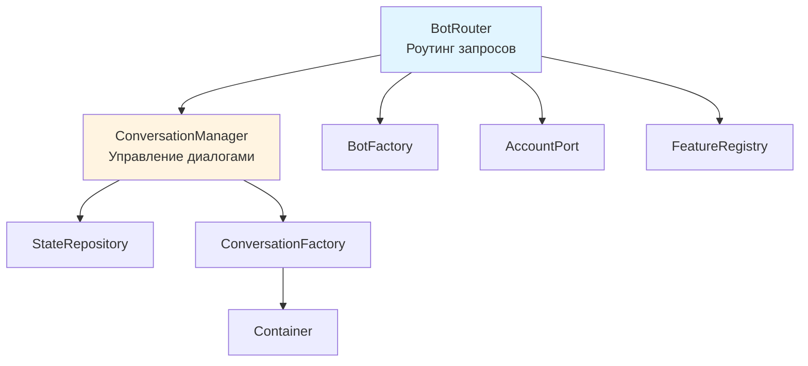

# Рефакторинг: Разделение обязанностей BotRouter и ConversationManager

## Проблема

В текущей реализации `BotRouter` и `ConversationManager` дублируют зависимости (`StateRepository`, `ConversationFactory`), что создает когнитивное дублирование логики:

- **BotRouter** использует `StateRepository` напрямую для проверки активного диалога (строка 67)
- **BotRouter** использует `ConversationFactory` напрямую для получения диалога по команде/callback (строки 106, 171)
- **ConversationManager** также использует эти же зависимости для управления диалогами

Это нарушает принцип единственной ответственности и создает неясность в разделении обязанностей.

## Решение

### Принцип разделения обязанностей

1. **BotRouter** - только роутинг:

   - Определяет тип запроса (команда, callback, сообщение)
   - Направляет запрос в соответствующий обработчик
   - Работает с адаптерами мессенджеров и отправкой ответов
   - НЕ работает напрямую с диалогами и состоянием

2. **ConversationManager** - полное управление диалогами:

   - Проверка наличия активного диалога
   - Получение диалога по коду
   - Управление жизненным циклом диалогов (старт, возобновление, обработка)
   - Работа с состоянием через StateRepository

## Изменения

### 1. Расширить ConversationManager

**Файл:** [services/aivalone-backend/src/Context/Bot/Application/Service/ConversationManager.php](services/aivalone-backend/src/Context/Bot/Application/Service/ConversationManager.php)

Добавить методы:

- `hasActiveConversation(UserId $userId): bool` - проверка наличия активного диалога
- `getConversationByCode(string $conversationCode): ConversationInterface` - получение диалога по коду (обертка над ConversationFactory)
- `canStartConversation(string $conversationCode, UserId $userId): bool` - проверка возможности запуска диалога (опционально, для валидации)

### 2. Упростить BotRouter

**Файл:** [services/aivalone-backend/src/Context/Bot/Application/Service/BotRouter.php](services/aivalone-backend/src/Context/Bot/Application/Service/BotRouter.php)

Изменения:

- Удалить зависимость `StateRepositoryInterface $stateRepository` из конструктора
- Удалить зависимость `ConversationFactory $conversationFactory` из конструктора
- Заменить прямую проверку `$this->stateRepository->findByUserId($userId)` на `$this->conversationManager->hasActiveConversation($userId)`
- Заменить прямые вызовы `$this->conversationFactory->get($conversationCode)` на `$this->conversationManager->getConversationByCode($conversationCode)`
- В методе `handleConversation` убрать параметр `$state`, так как проверка будет внутри ConversationManager

### 3. Обновить методы ConversationManager

**Файл:** [services/aivalone-backend/src/Context/Bot/Application/Service/ConversationManager.php](services/aivalone-backend/src/Context/Bot/Application/Service/ConversationManager.php)

- Метод `handleMessage` уже использует `StateRepository` внутри - оставить как есть
- Метод `startOrResume` уже использует `StateRepository` внутри - оставить как есть

## Диаграмма зависимостей после рефакторинга

## Преимущества

1. **Четкое разделение обязанностей**: BotRouter - роутинг, ConversationManager - управление диалогами
2. **Устранение дублирования**: BotRouter больше не работает напрямую с StateRepository и ConversationFactory
3. **Улучшенная инкапсуляция**: Вся логика работы с диалогами инкапсулирована в ConversationManager
4. **Упрощение тестирования**: Меньше зависимостей в BotRouter, проще мокировать
5. **Лучшая поддерживаемость**: Изменения в логике диалогов не затрагивают BotRouter