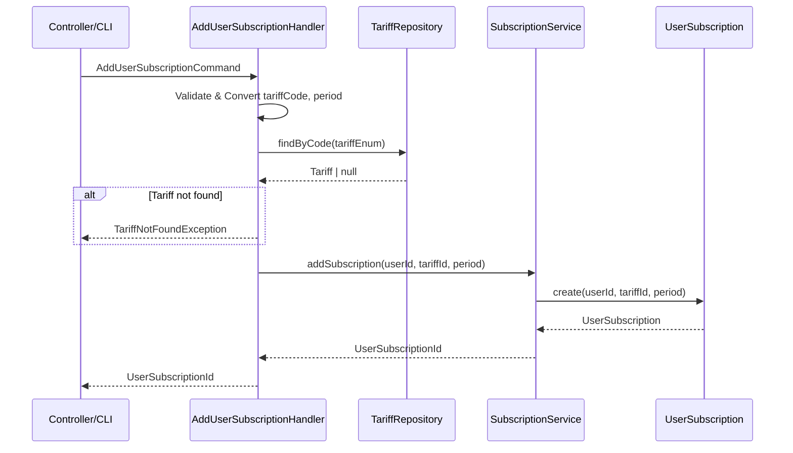

# Задача 0043: AddUserSubscription Command Handler

## Описание

Создать Command Handler для добавления подписки пользователю.

## Фаза

**Phase 4: Application Layer**

## Спецификация

📄 [add-user-subscription-process.md](../backend/billing/processes/add-user-subscription-process.md)

## Зависимости

- ⏳ `SubscriptionService` — задача 0046
- ⏳ `TariffRepository` — задача 0048
- ⏳ `Tariff` Enum — задача 0039
- ⏳ `SubscriptionPeriod` Enum — задача 0040
- ⏳ Exceptions — задача 0041

## Расположение файлов

```
src/Context/Billing/Application/Command/
├── AddUserSubscriptionCommand.php
└── AddUserSubscriptionHandler.php
```

---

## AddUserSubscriptionCommand

```php
final readonly class AddUserSubscriptionCommand
{
    public function __construct(
        public string $userId,
        public string $tariffCode,
        public string $period // 'month' | 'year'
    ) {}
}
```

---

## AddUserSubscriptionHandler

### Ответственность

1. Валидация входных параметров
2. Конвертация строк в типизированные объекты (enum, ValueObject)
3. Делегирование бизнес-логики в `SubscriptionService`

### Логика

```php
class AddUserSubscriptionHandler
{
    public function __construct(
        private SubscriptionService $subscriptionService,
        private TariffRepositoryInterface $tariffRepository
    ) {}

    public function __invoke(AddUserSubscriptionCommand $command): UserSubscriptionId
    {
        // 1. Валидация и конвертация tariffCode
        $tariffEnum = Tariff::fromCode($command->tariffCode);

        // 2. Валидация и конвертация period
        $period = SubscriptionPeriod::fromCode($command->period);

        // 3. Получение тарифа
        $tariff = $this->tariffRepository->findByCode($tariffEnum);
        if (!$tariff) {
            throw TariffNotFoundException::withCode($tariffEnum);
        }

        // 4. Конвертация userId
        $userId = UserId::fromString($command->userId);

        // 5. Делегирование в сервис
        return $this->subscriptionService->addSubscription(
            $userId,
            $tariff->getId(),
            $period
        );
    }
}
```

---

## Диаграмма процесса



---

## Исключения

| Исключение | Когда |
| ---------- | ----- |
| `InvalidTariffCodeException` | Невалидный код тарифа |
| `TariffNotFoundException` | Тариф не найден |
| `DuplicateSubscriptionException` | Уже есть активная подписка на этот тариф |
| `InvalidUuidException` | Невалидный userId |

---

## Критерии готовности

- [x] Создан `AddUserSubscriptionCommand` (DTO)
- [x] Создан `AddUserSubscriptionHandler`
- [x] Handler только валидирует и конвертирует
- [x] Бизнес-логика делегирована в `SubscriptionService`
- [ ] Написаны unit-тесты
- [x] Код соответствует PSR-12

## Статус: ✅ ВЫПОЛНЕНО

## Связанные задачи

- 0046: SubscriptionService
- 0048: Doctrine Infrastructure
