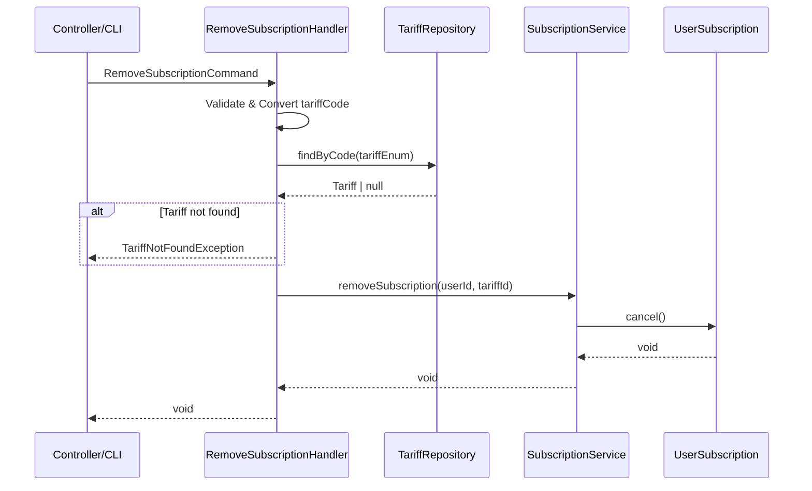

# Задача 0044: RemoveSubscription Command Handler

## Описание

Создать Command Handler для удаления/отмены подписки пользователя.

## Фаза

**Phase 4: Application Layer**

## Спецификация

📄 [remove-subscription-process.md](../backend/billing/processes/remove-subscription-process.md)

## Зависимости

- ⏳ `SubscriptionService` — задача 0046
- ⏳ `TariffRepository` — задача 0048
- ⏳ `Tariff` Enum — задача 0039
- ⏳ Exceptions — задача 0041

## Расположение файлов

```
src/Context/Billing/Application/Command/
├── RemoveSubscriptionCommand.php
└── RemoveSubscriptionHandler.php
```

---

## RemoveSubscriptionCommand

```php
final readonly class RemoveSubscriptionCommand
{
    public function __construct(
        public string $userId,
        public string $tariffCode
    ) {}
}
```

---

## RemoveSubscriptionHandler

### Ответственность

1. Валидация входных параметров
2. Конвертация строк в типизированные объекты
3. Делегирование бизнес-логики в `SubscriptionService`

### Логика

```php
class RemoveSubscriptionHandler
{
    public function __construct(
        private SubscriptionService $subscriptionService,
        private TariffRepositoryInterface $tariffRepository
    ) {}

    public function __invoke(RemoveSubscriptionCommand $command): void
    {
        // 1. Валидация и конвертация tariffCode
        $tariffEnum = Tariff::fromCode($command->tariffCode);

        // 2. Получение тарифа
        $tariff = $this->tariffRepository->findByCode($tariffEnum);
        if (!$tariff) {
            throw TariffNotFoundException::withCode($tariffEnum);
        }

        // 3. Конвертация userId
        $userId = UserId::fromString($command->userId);

        // 4. Делегирование в сервис
        $this->subscriptionService->removeSubscription($userId, $tariff->getId());
    }
}
```

---

## Диаграмма процесса



---

## Исключения

| Исключение | Когда |
| ---------- | ----- |
| `InvalidTariffCodeException` | Невалидный код тарифа |
| `TariffNotFoundException` | Тариф не найден |
| `SubscriptionNotFoundException` | Подписка не найдена |
| `InvalidUuidException` | Невалидный userId |

---

## Критерии готовности

- [x] Создан `RemoveSubscriptionCommand` (DTO)
- [x] Создан `RemoveSubscriptionHandler`
- [x] Handler только валидирует и конвертирует
- [x] Бизнес-логика делегирована в `SubscriptionService`
- [ ] Написаны unit-тесты
- [x] Код соответствует PSR-12

## Статус: ✅ ВЫПОЛНЕНО

## Связанные задачи

- 0043: AddUserSubscription Command Handler
- 0046: SubscriptionService
- 0048: Doctrine Infrastructure
