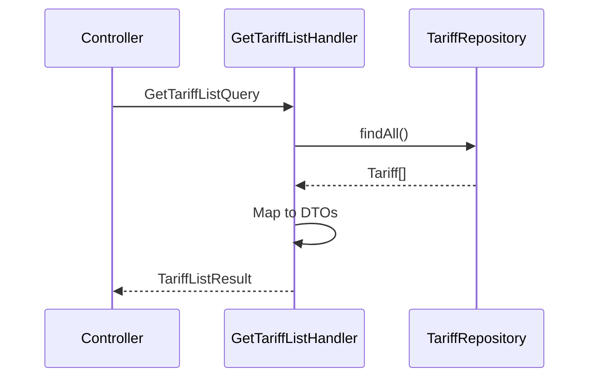

# Задача 0045: GetTariffList Query Handler

## Описание

Создать Query Handler для получения списка всех доступных тарифов с их опциями.

## Фаза

**Phase 4: Application Layer**

## Спецификация

📄 [get-tariff-list-process.md](../backend/billing/processes/get-tariff-list-process.md)

## Зависимости

- ⏳ `TariffRepository` — задача 0048

## Расположение файлов

```
src/Context/Billing/Application/Query/
├── GetTariffListQuery.php
├── GetTariffListHandler.php
└── TariffListResult.php
```

---

## GetTariffListQuery

```php
final readonly class GetTariffListQuery
{
    // Пустой query — получить все тарифы
}
```

---

## TariffListResult (DTO)

```php
final readonly class TariffListResult
{
    /**
     * @param TariffDto[] $tariffs
     */
    public function __construct(
        public array $tariffs
    ) {}
}

final readonly class TariffDto
{
    /**
     * @param TariffOptionDto[] $options
     */
    public function __construct(
        public string $id,
        public string $code,
        public string $name,
        public int $priority,
        public float $price,
        public array $options
    ) {}
}

final readonly class TariffOptionDto
{
    public function __construct(
        public string $name,
        public string $code,
        public string $type,
        public mixed $value
    ) {}
}
```

---

## GetTariffListHandler

### Логика

```php
class GetTariffListHandler
{
    public function __construct(
        private TariffRepositoryInterface $tariffRepository
    ) {}

    public function __invoke(GetTariffListQuery $query): TariffListResult
    {
        $tariffs = $this->tariffRepository->findAll();

        $tariffDtos = array_map(
            fn(Tariff $tariff) => new TariffDto(
                id: $tariff->getId()->toString(),
                code: $tariff->getCode()->code(),
                name: $tariff->getName(),
                priority: $tariff->getPriority(),
                price: $tariff->getPrice(),
                options: array_map(
                    fn(TariffOption $option) => new TariffOptionDto(
                        name: $option->getName(),
                        code: $option->getCode(),
                        type: $option->getType()->code(),
                        value: $option->getValue()
                    ),
                    $tariff->getOptions()->toArray()
                )
            ),
            $tariffs
        );

        return new TariffListResult($tariffDtos);
    }
}
```

---

## Диаграмма процесса



---

## Пример ответа

```php
TariffListResult {
    tariffs: [
        TariffDto {
            id: "550e8400-e29b-41d4-a716-446655440000",
            code: "free",
            name: "Free Plan",
            priority: 0,
            price: 0.00,
            options: [
                TariffOptionDto {
                    name: "Max Groups",
                    code: "MAX_GROUPS",
                    type: "max_constraint",
                    value: 5
                }
            ]
        },
        // ... другие тарифы
    ]
}
```

---

## Критерии готовности

- [x] Создан `GetTariffListQuery` (DTO)
- [x] Созданы DTO классы (`TariffListResult`, `TariffDto`, `TariffOptionDto`)
- [x] Создан `GetTariffListHandler`
- [x] Handler возвращает DTO, не доменные объекты
- [ ] Написаны unit-тесты
- [x] Код соответствует PSR-12

## Статус: ✅ ВЫПОЛНЕНО

## Связанные задачи

- 0048: Doctrine Infrastructure
- 0050: REST API Controllers
