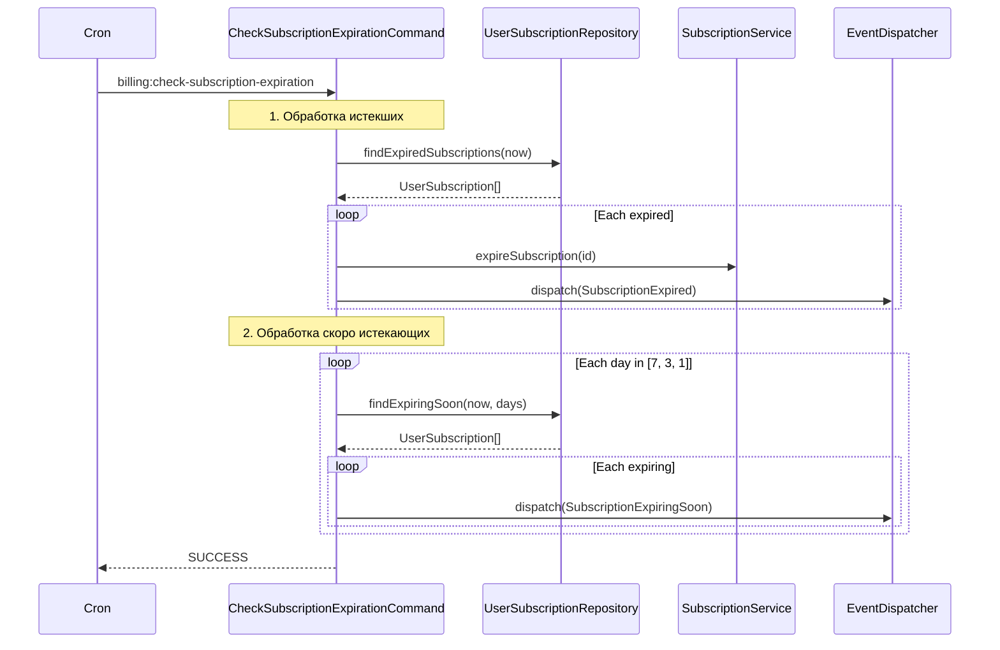

# Задача 0047: CLI Check Subscription Expiration Command

## Описание

Создать CLI команду для периодической проверки истечения подписок.

## Фаза

**Phase 4: Application Layer**

## Спецификация

📄 [check-subscription-expiration-process.md](../backend/billing/processes/check-subscription-expiration-process.md)

## Зависимости

- ⏳ `UserSubscriptionRepository` — задача 0048
- ⏳ `SubscriptionService` — задача 0046
- ⏳ Domain Events — задача 0042
- ✅ Symfony Console Component

## Расположение файла

```
src/Context/Billing/Infrastructure/Cli/CheckSubscriptionExpirationCommand.php
```

---

## Команда

```bash
php bin/console billing:check-subscription-expiration
```

---

## Реализация

```php
#[AsCommand(
    name: 'billing:check-subscription-expiration',
    description: 'Check for expired and expiring soon subscriptions'
)]
class CheckSubscriptionExpirationCommand extends Command
{
    private const EXPIRING_SOON_DAYS = [7, 3, 1];

    public function __construct(
        private UserSubscriptionRepositoryInterface $subscriptionRepository,
        private SubscriptionService $subscriptionService,
        private EventDispatcherInterface $eventDispatcher
    ) {
        parent::__construct();
    }

    protected function execute(InputInterface $input, OutputInterface $output): int
    {
        $io = new SymfonyStyle($input, $output);
        $now = new \DateTimeImmutable();

        // 1. Обработка истекших подписок
        $expiredCount = $this->processExpiredSubscriptions($now, $io);

        // 2. Обработка скоро истекающих подписок
        $expiringSoonCount = $this->processExpiringSoonSubscriptions($now, $io);

        $io->success(sprintf(
            'Processed: %d expired, %d expiring soon',
            $expiredCount,
            $expiringSoonCount
        ));

        return Command::SUCCESS;
    }

    private function processExpiredSubscriptions(
        \DateTimeImmutable $now,
        SymfonyStyle $io
    ): int {
        $expired = $this->subscriptionRepository->findExpiredSubscriptions($now);
        $count = 0;

        foreach ($expired as $subscription) {
            if ($subscription->isActive()) {
                $this->subscriptionService->expireSubscription($subscription->getId());

                $event = new SubscriptionExpired(
                    $subscription->getId(),
                    $subscription->getUserId(),
                    $subscription->getTariffId(),
                    $subscription->getValidUntil(),
                    $now
                );
                $this->eventDispatcher->dispatch($event);

                $count++;
                $io->text(sprintf(
                    'Expired subscription: %s',
                    $subscription->getId()->toString()
                ));
            }
        }

        return $count;
    }

    private function processExpiringSoonSubscriptions(
        \DateTimeImmutable $now,
        SymfonyStyle $io
    ): int {
        $count = 0;

        foreach (self::EXPIRING_SOON_DAYS as $days) {
            $subscriptions = $this->subscriptionRepository->findExpiringSoon($now, $days);

            foreach ($subscriptions as $subscription) {
                $event = new SubscriptionExpiringSoon(
                    $subscription->getId(),
                    $subscription->getUserId(),
                    $subscription->getTariffId(),
                    $days,
                    $subscription->getValidUntil(),
                    $now
                );
                $this->eventDispatcher->dispatch($event);

                $count++;
                $io->text(sprintf(
                    'Expiring soon (%d days): %s',
                    $days,
                    $subscription->getId()->toString()
                ));
            }
        }

        return $count;
    }
}
```

---

## Диаграмма процесса



---

## Cron настройка

Рекомендуется запускать 1-4 раза в день:

```cron
# Каждые 6 часов
0 */6 * * * php /path/to/bin/console billing:check-subscription-expiration
```

---

## Критерии готовности

- [x] Создана CLI команда `billing:check-subscription-expiration`
- [x] Обрабатываются истекшие подписки
- [x] Генерируются события `SubscriptionExpired`
- [x] Обрабатываются скоро истекающие (7, 3, 1 день)
- [x] Генерируются события `SubscriptionExpiringSoon`
- [ ] Написаны интеграционные тесты
- [x] Код соответствует PSR-12

## Статус: ✅ ВЫПОЛНЕНО

## Связанные задачи

- 0042: Domain Events
- 0046: SubscriptionService
- 0048: Doctrine Infrastructure
