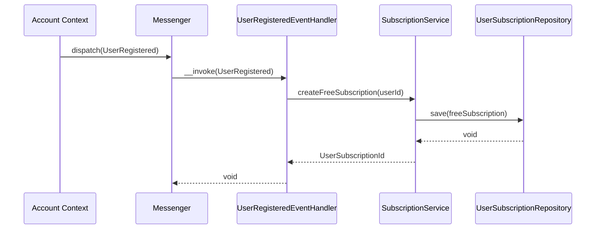

# Задача 0049: Billing Event Handlers

## Описание

Создать обработчики событий для Billing Context:
- `UserRegisteredEventHandler` — обработка события регистрации пользователя
- Дополнительные обработчики для GetUserLimits Query и RenewSubscription Command

## Фаза

**Phase 5: Infrastructure**

## Спецификации

- 📄 [user-registered-event-handler.md](../backend/billing/handlers/user-registered-event-handler.md)
- 📄 [get-user-limits-process.md](../backend/billing/processes/get-user-limits-process.md)
- 📄 [renew-subscription-process.md](../backend/billing/processes/renew-subscription-process.md)

## Зависимости

- ⏳ `SubscriptionService` — задача 0046
- ✅ `UserRegistered` Event (Account Context)
- ✅ Symfony Messenger Component

## Расположение файлов

```
src/Context/Billing/Application/
├── Event/
│   └── UserRegisteredEventHandler.php
├── Query/
│   ├── GetUserLimitsQuery.php
│   └── GetUserLimitsHandler.php
└── Command/
    ├── RenewSubscriptionCommand.php
    └── RenewSubscriptionHandler.php
```

---

## 1. UserRegisteredEventHandler

### Назначение

Слушает событие `UserRegistered` из Account Context и автоматически создаёт бессрочную FREE подписку для нового пользователя.

### Реализация

```php
#[AsMessageHandler]
class UserRegisteredEventHandler
{
    public function __construct(
        private SubscriptionService $subscriptionService,
        private LoggerInterface $logger
    ) {}

    public function __invoke(UserRegistered $event): void
    {
        try {
            $userId = UserId::fromString($event->getUserId());

            $subscriptionId = $this->subscriptionService->createFreeSubscription($userId);

            $this->logger->info('Created FREE subscription for new user', [
                'userId' => $event->getUserId(),
                'subscriptionId' => $subscriptionId->toString()
            ]);
        } catch (\Exception $e) {
            $this->logger->error('Failed to create FREE subscription', [
                'userId' => $event->getUserId(),
                'error' => $e->getMessage()
            ]);
            throw $e;
        }
    }
}
```

### Диаграмма



---

## 2. GetUserLimitsQuery & Handler

### Назначение

Query для получения агрегированных лимитов пользователя из всех его активных подписок.

### GetUserLimitsQuery

```php
final readonly class GetUserLimitsQuery
{
    public function __construct(
        public string $userId
    ) {}
}
```

### GetUserLimitsHandler

```php
class GetUserLimitsHandler
{
    public function __construct(
        private UserSubscriptionRepositoryInterface $subscriptionRepository,
        private TariffRepositoryInterface $tariffRepository
    ) {}

    public function __invoke(GetUserLimitsQuery $query): array
    {
        $userId = UserId::fromString($query->userId);
        $subscriptions = $this->subscriptionRepository->findActiveByUserId($userId);

        if (empty($subscriptions)) {
            return [];
        }

        $limits = [];

        foreach ($subscriptions as $subscription) {
            $tariff = $this->tariffRepository->findById($subscription->getTariffId());
            if (!$tariff) {
                continue;
            }

            foreach ($tariff->getOptions() as $option) {
                $code = $option->getCode();
                $value = $option->getValue();
                $type = $option->getType();

                if (!isset($limits[$code])) {
                    $limits[$code] = $value;
                    continue;
                }

                // Агрегация по типу
                $limits[$code] = match ($type) {
                    TariffOptionType::MAX_CONSTRAINT => max($limits[$code], $value),
                    TariffOptionType::BOOL => $limits[$code] || $value,
                    TariffOptionType::TEXT => $this->getHigherPriorityValue(
                        $limits[$code],
                        $value,
                        $tariff->getPriority()
                    ),
                };
            }
        }

        return $limits;
    }
}
```

---

## 3. RenewSubscriptionCommand & Handler

### RenewSubscriptionCommand

```php
final readonly class RenewSubscriptionCommand
{
    public function __construct(
        public string $userId,
        public string $tariffCode,
        public string $period
    ) {}
}
```

### RenewSubscriptionHandler

```php
class RenewSubscriptionHandler
{
    public function __construct(
        private SubscriptionService $subscriptionService,
        private TariffRepositoryInterface $tariffRepository
    ) {}

    public function __invoke(RenewSubscriptionCommand $command): UserSubscriptionId
    {
        // 1. Валидация и конвертация
        $tariffEnum = Tariff::fromCode($command->tariffCode);
        $period = SubscriptionPeriod::fromCode($command->period);

        // 2. Получение тарифа
        $tariff = $this->tariffRepository->findByCode($tariffEnum);
        if (!$tariff) {
            throw TariffNotFoundException::withCode($tariffEnum);
        }

        // 3. Конвертация userId
        $userId = UserId::fromString($command->userId);

        // 4. Делегирование в сервис
        return $this->subscriptionService->renewSubscription(
            $userId,
            $tariff->getId(),
            $period
        );
    }
}
```

---

## Критерии готовности

- [x] Создан `UserRegisteredEventHandler`
- [x] Handler зарегистрирован в Symfony Messenger
- [x] Создан `GetUserLimitsQuery` и `GetUserLimitsHandler`
- [x] Реализована логика агрегации лимитов
- [x] Создан `RenewSubscriptionCommand` и `RenewSubscriptionHandler`
- [ ] Написаны unit-тесты
- [x] Код соответствует PSR-12

## Статус: ✅ ВЫПОЛНЕНО

## Связанные задачи

- 0046: SubscriptionService
- 0048: Doctrine Infrastructure
