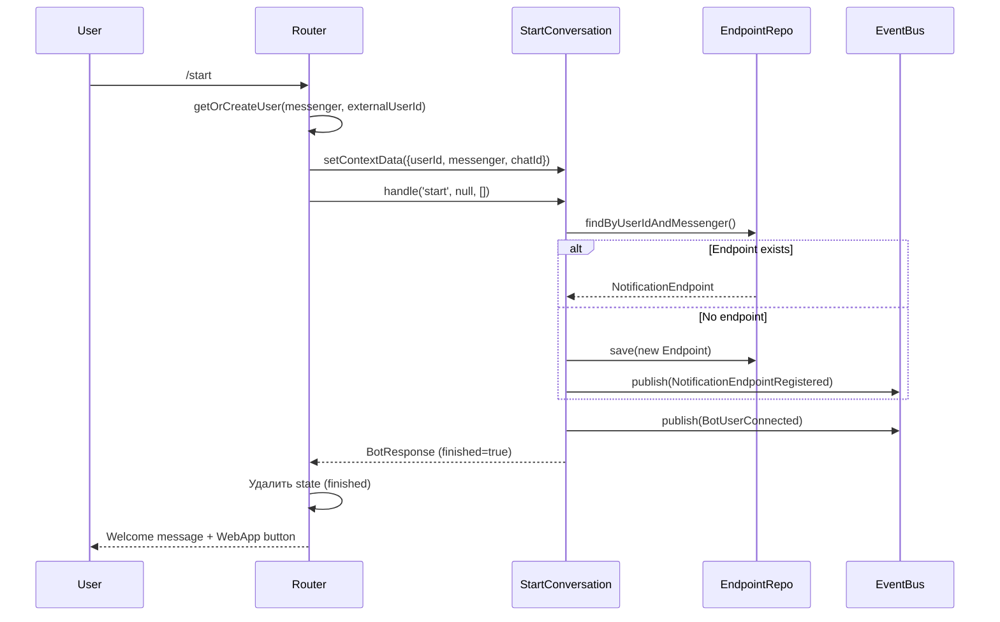

# Задача 0062: StartConversation Implementation

## Контекст

StartConversation — основной диалог инициализации пользователя. Обрабатывает команду /start, регистрирует NotificationEndpoint и показывает приветствие с WebApp кнопкой.

## Цель

Создать диалог `StartConversation` для обработки /start.

## Спецификация

- [StartConversation](../backend/bot/conversations/start-conversation.md)

## Файлы для создания

```
src/Context/Bot/Domain/Conversation/StartConversation.php
tests/Unit/Context/Bot/Domain/Conversation/StartConversationTest.php
```

## Важно

1. **canHandle не нужен в каждом диалоге** — это общая логика в AbstractConversation (command == getCommand())
2. **Router устанавливает контекст** — userId, messenger, chatId доступны через getContextParam()
3. **Это "reset" команда** — сбрасывает текущий state
4. **Текст приветствия из спецификации**

## Требования

### StartConversation

```php
<?php

declare(strict_types=1);

namespace App\Context\Bot\Domain\Conversation;

use App\Context\Bot\Domain\Event\BotUserConnected;
use App\Context\Bot\Domain\Model\BotResponse;
use App\Context\Bot\Domain\Model\NotificationEndpoint;
use App\Context\Bot\Domain\Repository\NotificationEndpointRepositoryInterface;
use App\Context\Shared\Application\EventBusInterface;
use App\Context\Shared\Domain\Enum\Messenger;
use App\Context\Shared\Domain\ValueObject\UserId;

final class StartConversation extends AbstractConversation
{
    public function __construct(
        private readonly NotificationEndpointRepositoryInterface $endpointRepository,
        private readonly EventBusInterface $eventBus,
        private readonly WebAppUrlGenerator $webAppUrlGenerator,
    ) {}

    public function getCode(): string
    {
        return 'start';
    }

    public function getDescription(): string
    {
        return 'Начало работы с ботом';
    }

    protected function getInitialStep(): string
    {
        return 'start';
    }

    /**
     * @param array<string, string> $params
     */
    protected function stepStart(?string $message, array $params): BotResponse
    {
        // Данные контекста установлены роутером
        $userId = $this->getContextParam('userId');
        $messenger = $this->getContextParam('messenger');
        $chatId = $this->getContextParam('chatId');

        // 1. Регистрация endpoint (если не существует)
        $this->registerEndpointIfNeeded($userId, $messenger, $chatId);

        // 2. Генерация события BotUserConnected
        $this->publishBotUserConnected($userId, $messenger);

        // 3. Формирование приветственного сообщения
        return $this->buildWelcomeResponse($messenger, $userId);
    }

    private function registerEndpointIfNeeded(
        string $userId,
        string $messenger,
        string $chatId,
    ): void {
        $userIdVo = UserId::fromString($userId);
        $messengerEnum = Messenger::from($messenger);

        $existing = $this->endpointRepository->findByUserIdAndMessenger(
            $userIdVo,
            $messengerEnum,
        );

        if ($existing !== null && $existing->isActive()) {
            return;
        }

        $endpoint = NotificationEndpoint::create(
            $userIdVo,
            $messengerEnum,
            $chatId,
        );

        $this->endpointRepository->save($endpoint);

        foreach ($endpoint->pullEvents() as $event) {
            $this->eventBus->publish($event);
        }
    }

    private function publishBotUserConnected(string $userId, string $messenger): void
    {
        $this->eventBus->publish(new BotUserConnected(
            userId: $userId,
            messenger: $messenger,
            occurredAt: new \DateTimeImmutable(),
        ));
    }

    private function buildWelcomeResponse(string $messenger, string $userId): BotResponse
    {
        $welcomeMessage = $this->getWelcomeMessage();
        $keyboard = $this->buildKeyboard($messenger, $userId);

        return BotResponse::finishWithKeyboard($welcomeMessage, $keyboard);
    }

    /**
     * @return array<array<array{text: string, action: string}>>
     */
    private function buildKeyboard(string $messenger, string $userId): array
    {
        if ($messenger === 'telegram') {
            $webAppUrl = $this->webAppUrlGenerator->generate($userId);

            return [
                [['text' => '🚀 Открыть приложение', 'action' => 'web_app:' . $webAppUrl]],
                [['text' => '❓ Помощь', 'action' => '/help']],
            ];
        }

        // Для других мессенджеров — ссылка с токеном
        $authUrl = $this->webAppUrlGenerator->generateWithToken($userId);

        return [
            [['text' => '🚀 Открыть приложение', 'action' => 'url:' . $authUrl]],
            [['text' => '❓ Помощь', 'action' => '/help']],
        ];
    }

    private function getWelcomeMessage(): string
    {
        return <<<'TEXT'
👋 Добро пожаловать в Aivalone!

Я помогу вам настроить мониторинг Telegram-каналов и получать уведомления о важных событиях.

🚀 Нажмите кнопку ниже, чтобы открыть приложение и начать работу.
TEXT;
    }
}
```

### WebAppUrlGenerator

```php
<?php

declare(strict_types=1);

namespace App\Context\Bot\Domain\Conversation;

/**
 * Генератор URL для WebApp.
 */
interface WebAppUrlGenerator
{
    /**
     * Генерация URL для Telegram WebApp (init_data).
     */
    public function generate(string $userId): string;

    /**
     * Генерация URL с auth токеном (для других мессенджеров).
     */
    public function generateWithToken(string $userId): string;
}
```

## Контекст диалога

Router устанавливает следующие данные в контекст перед вызовом:

| Ключ | Тип | Описание |
|------|-----|----------|
| `userId` | `string` | UUID пользователя из Account Context |
| `messenger` | `string` | Код мессенджера (telegram, whatsapp, etc) |
| `chatId` | `string` | Внешний ID чата (только для регистрации endpoint) |

## Логика работы



## Тесты

- [x] getCode() возвращает 'start'
- [x] getCommand() возвращает '/start'
- [x] stepStart() создаёт endpoint если его нет
- [x] stepStart() не дублирует endpoint если уже есть
- [x] stepStart() публикует BotUserConnected
- [x] stepStart() возвращает сообщение с WebApp кнопкой для telegram
- [x] stepStart() возвращает сообщение с URL кнопкой для других мессенджеров
- [x] Response имеет finished=true (диалог завершается сразу)
- [x] Контекст (userId, messenger, chatId) корректно читается

## Зависимости

- `AbstractConversation` (задача 0061)
- `NotificationEndpoint` (задача 0055)
- `NotificationEndpointRepositoryInterface` (задача 0059)
- `BotResponse` (задача 0054)
- `BotUserConnected` (задача 0058)
- `EventBusInterface` (Shared)

## Definition of Done

- [x] Класс StartConversation создан
- [x] WebAppUrlGenerator интерфейс создан
- [x] Интеграция с NotificationEndpointRepository
- [x] Интеграция с EventBus
- [x] Unit-тесты написаны и проходят
- [ ] Код соответствует PSR-12
- [ ] PHPStan level 9 без ошибок
