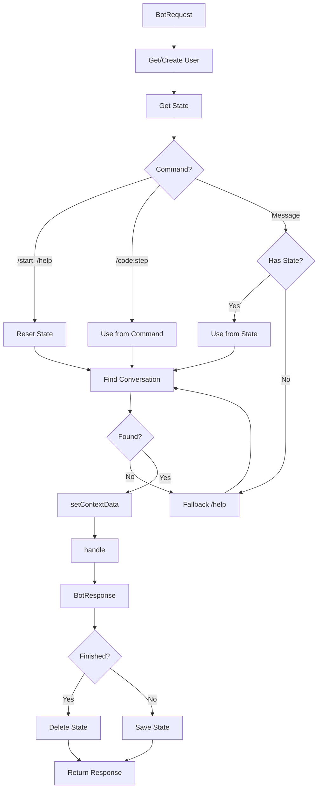

# Задача 0064: Router Service

## Контекст

Router — основной сервис маршрутизации входящих сообщений. Определяет, какой диалог должен обработать запрос, управляет состоянием диалогов и координирует выполнение.

## Цель

Создать сервис `Router` для маршрутизации сообщений.

## Спецификация

- [Router Service](../backend/bot/services/router.md)

## Файлы для создания

```
src/Context/Bot/Application/Service/Router.php
tests/Unit/Context/Bot/Application/Service/RouterTest.php
```

## Важно

1. **Router управляет state** — создаёт, сохраняет, удаляет ConversationState
2. **Router устанавливает contextData** — перед вызовом handle()
3. **Router забирает данные после handle** — currentStep и contextData
4. **findByCommand** — т.к. command может отличаться от code
5. **Reset команды** — /start и /help сбрасывают текущий state

## Требования

### Router

```php
<?php

declare(strict_types=1);

namespace App\Context\Bot\Application\Service;

use App\Context\Bot\Domain\Conversation\ConversationInterface;
use App\Context\Bot\Domain\Model\BotRequest;
use App\Context\Bot\Domain\Model\BotResponse;
use App\Context\Bot\Domain\Model\ConversationState;
use App\Context\Bot\Domain\Repository\ConversationStateRepositoryInterface;
use App\Context\Bot\Domain\Repository\NotificationEndpointRepositoryInterface;
use App\Context\Shared\Domain\Enum\Messenger;
use App\Context\Shared\Domain\ValueObject\UserId;
use Psr\Log\LoggerInterface;

final class Router
{
    private const array RESET_COMMANDS = ['start', 'help'];

    public function __construct(
        private readonly ConversationRegistry $conversationRegistry,
        private readonly ConversationStateRepositoryInterface $stateRepository,
        private readonly NotificationEndpointRepositoryInterface $endpointRepository,
        private readonly UserServiceInterface $userService,
        private readonly MessageSender $messageSender,
        private readonly LoggerInterface $logger,
    ) {}

    /**
     * Обрабатывает входящий запрос.
     */
    public function handle(BotRequest $request): BotResponse
    {
        $this->logger->info('Routing request', [
            'messenger' => $request->getMessenger()->value,
            'is_command' => $request->isCommand(),
            'command' => $request->getCommand(),
        ]);

        // 1. Получить или создать пользователя
        $userId = $this->resolveUserId($request);

        // 2. Получить текущий state пользователя
        $state = $this->stateRepository->find($userId, $request->getMessenger());

        // 3. Определить диалог и шаг
        [$conversation, $stepCode, $params, $shouldResetState] = $this->resolveConversationAndStep(
            $request,
            $state,
        );

        // Если нужно сбросить state
        if ($shouldResetState && $state !== null) {
            $this->stateRepository->delete($userId, $request->getMessenger());
            $state = null;
        }

        // Если диалог не найден — fallback
        if ($conversation === null) {
            return $this->handleFallback($request);
        }

        // 4. Установить контекст диалога
        $conversation->setContextData(
            $this->buildContextData($request, $userId, $state),
        );

        // 5. Вызвать обработчик диалога
        $response = $conversation->handle($stepCode, $request->getMessage(), $params);

        // 6. Обработать результат
        $this->handleResult($conversation, $response, $userId, $request->getMessenger());

        return $response;
    }

    /**
     * @return array{ConversationInterface|null, ?string, array<string, string>, bool}
     */
    private function resolveConversationAndStep(
        BotRequest $request,
        ?ConversationState $state,
    ): array {
        // Если это команда
        if ($request->isCommand()) {
            $command = $request->getCommand();
            $conversation = $this->conversationRegistry->findByCommand('/' . $command);

            if ($conversation !== null) {
                $shouldReset = $this->isResetCommand($command);

                return [
                    $conversation,
                    $request->getStep(),
                    $request->getParams(),
                    $shouldReset,
                ];
            }
        }

        // Если есть активный state — продолжаем диалог
        if ($state !== null) {
            $conversation = $this->conversationRegistry->findByCode(
                $state->getConversationCode(),
            );

            if ($conversation !== null) {
                return [
                    $conversation,
                    $state->getStepCode(),
                    [],
                    false,
                ];
            }
        }

        // Fallback
        return [null, null, [], false];
    }

    /**
     * @return array<string, mixed>
     */
    private function buildContextData(
        BotRequest $request,
        UserId $userId,
        ?ConversationState $state,
    ): array {
        // Базовые данные от Router
        $context = [
            'userId' => $userId->toString(),
            'messenger' => $request->getMessenger()->value,
            'chatId' => $request->getExternalChatId(),
        ];

        // Данные из существующего state
        if ($state !== null) {
            $context = array_merge($state->getContextData(), $context);
        }

        return $context;
    }

    private function handleResult(
        ConversationInterface $conversation,
        BotResponse $response,
        UserId $userId,
        Messenger $messenger,
    ): void {
        if ($response->isFinished()) {
            // Диалог завершён — удаляем состояние
            $this->stateRepository->delete($userId, $messenger);

            $this->logger->debug('Conversation finished, state deleted', [
                'conversation' => $conversation->getCode(),
            ]);
        } else {
            // Диалог продолжается — сохраняем/обновляем состояние
            $state = $this->stateRepository->find($userId, $messenger);

            if ($state === null) {
                $state = ConversationState::create(
                    $userId,
                    $messenger,
                    $conversation->getCode(),
                    $conversation->getCurrentStep(),
                    $conversation->getContextData(),
                );
            } else {
                $state->update(
                    $conversation->getCode(),
                    $conversation->getCurrentStep(),
                    $conversation->getContextData(),
                );
            }

            $this->stateRepository->save($state);

            $this->logger->debug('Conversation state saved', [
                'conversation' => $conversation->getCode(),
                'step' => $conversation->getCurrentStep(),
            ]);
        }
    }

    private function resolveUserId(BotRequest $request): UserId
    {
        // Получаем или создаём пользователя через Account Context
        return $this->userService->getOrCreateByMessenger(
            $request->getMessenger(),
            $request->getExternalUserId(),
        );
    }

    private function isResetCommand(string $command): bool
    {
        return in_array($command, self::RESET_COMMANDS, true);
    }

    private function handleFallback(BotRequest $request): BotResponse
    {
        $helpConversation = $this->conversationRegistry->findByCode('help');

        if ($helpConversation !== null) {
            return $helpConversation->handle(null, null, []);
        }

        return BotResponse::message(
            'Я не понимаю эту команду. Используйте /start для начала.',
        );
    }
}
```

### UserServiceInterface

```php
<?php

declare(strict_types=1);

namespace App\Context\Bot\Application\Service;

use App\Context\Shared\Domain\Enum\Messenger;
use App\Context\Shared\Domain\ValueObject\UserId;

/**
 * Интерфейс для интеграции с Account Context.
 */
interface UserServiceInterface
{
    /**
     * Получить или создать пользователя по данным мессенджера.
     */
    public function getOrCreateByMessenger(
        Messenger $messenger,
        string $externalUserId,
    ): UserId;
}
```

## Алгоритм маршрутизации



## Тесты

- [x] handle() вызывает getOrCreateUser
- [x] handle() находит диалог по команде через findByCommand
- [x] handle() продолжает активный диалог из state
- [x] handle() сбрасывает state для reset-команд (/start, /help)
- [x] handle() устанавливает contextData перед вызовом
- [x] handle() сохраняет state при продолжении диалога
- [x] handle() удаляет state при завершении диалога
- [x] handle() возвращает fallback для неизвестных команд
- [x] contextData содержит userId, messenger, chatId

## Зависимости

- `ConversationRegistry` (задача 0065)
- `MessageSender` (задача 0066)
- `ConversationStateRepositoryInterface` (задача 0060)
- `NotificationEndpointRepositoryInterface` (задача 0059)
- `BotRequest` (задача 0053)
- `BotResponse` (задача 0054)
- `ConversationState` (задача 0056)

## Definition of Done

- [x] Класс Router создан
- [x] UserServiceInterface создан
- [x] Алгоритм маршрутизации реализован
- [x] Управление state реализовано
- [x] Unit-тесты написаны и проходят
- [x] Код соответствует PSR-12
- [x] PHPStan level 9 без ошибок
