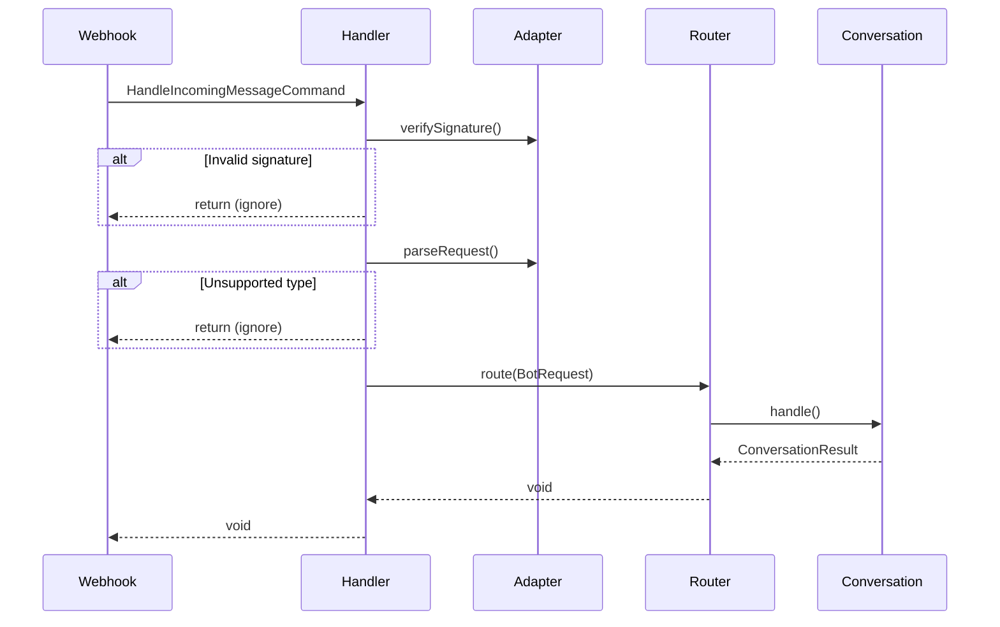

# Задача 0073: HandleIncomingMessage Command Handler

## Контекст

Command для обработки входящего сообщения от webhook. Является точкой входа для всех сообщений из мессенджеров.

## Цель

Создать Command и Handler для обработки входящих сообщений.

## Спецификация

- [Handle Incoming Message Process](../backend/bot/processes/handle-incoming-message.md)

## Файлы для создания

```
src/Context/Bot/Application/Command/HandleMessage/HandleIncomingMessageCommand.php
src/Context/Bot/Application/Command/HandleMessage/HandleIncomingMessageHandler.php
tests/Unit/Context/Bot/Application/Command/HandleMessage/HandleIncomingMessageHandlerTest.php
```

## Требования

### HandleIncomingMessageCommand

```php
<?php

declare(strict_types=1);

namespace App\Context\Bot\Application\Command\HandleMessage;

use App\Context\Shared\Domain\Enum\Messenger;

final readonly class HandleIncomingMessageCommand
{
    /**
     * @param array<string, mixed> $payload Raw данные от webhook
     * @param array<string, string> $headers HTTP заголовки запроса
     */
    public function __construct(
        public Messenger $messenger,
        public array $payload,
        public array $headers = [],
    ) {}
}
```

### HandleIncomingMessageHandler

```php
<?php

declare(strict_types=1);

namespace App\Context\Bot\Application\Command\HandleMessage;

use App\Context\Bot\Application\Adapter\MessengerAdapterInterface;
use App\Context\Bot\Application\Service\Router;
use App\Context\Shared\Domain\Enum\Messenger;
use Psr\Log\LoggerInterface;
use Symfony\Component\Messenger\Attribute\AsMessageHandler;

#[AsMessageHandler]
final class HandleIncomingMessageHandler
{
    /**
     * @var array<string, MessengerAdapterInterface>
     */
    private array $adapters = [];

    /**
     * @param iterable<MessengerAdapterInterface> $adapters
     */
    public function __construct(
        iterable $adapters,
        private readonly Router $router,
        private readonly LoggerInterface $logger,
    ) {
        foreach ($adapters as $adapter) {
            $this->adapters[$adapter->supports()->value] = $adapter;
        }
    }

    public function __invoke(HandleIncomingMessageCommand $command): void
    {
        $adapter = $this->getAdapter($command->messenger);

        // 1. Проверяем подпись (безопасность)
        if (!$adapter->verifySignature($command->payload, $command->headers)) {
            $this->logger->warning('Invalid webhook signature', [
                'messenger' => $command->messenger->value,
            ]);
            return;
        }

        // 2. Парсим payload в BotRequest
        $request = $adapter->parseRequest($command->payload);

        if ($request === null) {
            $this->logger->debug('Unsupported message type, skipping', [
                'messenger' => $command->messenger->value,
            ]);
            return;
        }

        $this->logger->info('Processing incoming message', [
            'messenger' => $command->messenger->value,
            'is_command' => $request->isCommand(),
            'is_callback' => $request->isCallback(),
        ]);

        // 3. Передаём в Router для обработки
        try {
            $this->router->route($request);
        } catch (\Throwable $e) {
            $this->logger->error('Failed to process message', [
                'messenger' => $command->messenger->value,
                'error' => $e->getMessage(),
            ]);

            // Не пробрасываем исключение — webhook должен вернуть 200
            // Иначе мессенджер будет повторять запрос
        }
    }

    private function getAdapter(Messenger $messenger): MessengerAdapterInterface
    {
        if (!isset($this->adapters[$messenger->value])) {
            throw new \RuntimeException(
                sprintf('No adapter for messenger "%s"', $messenger->value),
            );
        }

        return $this->adapters[$messenger->value];
    }
}
```

## Flow обработки



## Важные аспекты

1. **Безопасность** — всегда проверяем подпись webhook
2. **Resilience** — ловим исключения, чтобы webhook вернул 200
3. **Idempotency** — повторные сообщения обрабатываются корректно
4. **Logging** — логируем все этапы для отладки

## Тесты

- [ ] Handler проверяет подпись и игнорирует невалидные
- [ ] Handler парсит payload через adapter
- [ ] Handler игнорирует неподдерживаемые типы сообщений
- [ ] Handler передаёт BotRequest в Router
- [ ] Handler ловит исключения и не пробрасывает
- [ ] Handler логирует все этапы
- [ ] Handler выбирает правильный adapter по messenger

## Зависимости

- `MessengerAdapterInterface` (задача 0063)
- `Router` (задача 0064)
- `BotRequest` (задача 0053)
- `App\Context\Shared\Domain\Enum\Messenger` (задача 0006)

## Definition of Done

- [x] Command класс создан
- [x] Handler реализован
- [x] Unit-тесты написаны и проходят
- [x] Код соответствует PSR-12
- [x] PHPStan level 9 без ошибок
