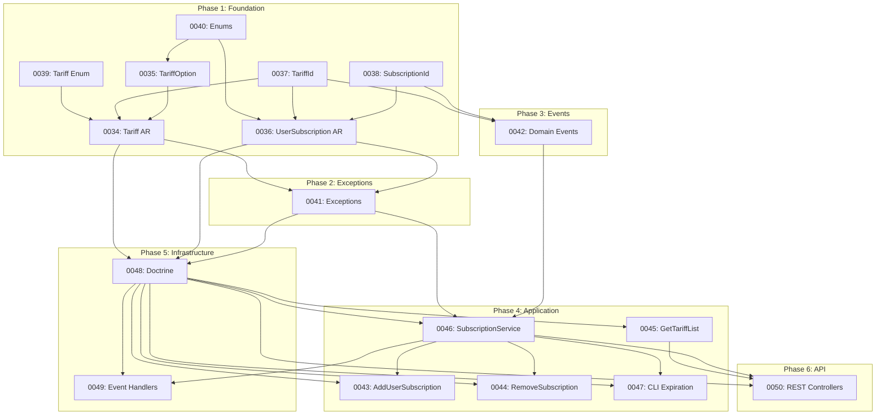

# План реализации Billing Context

## Обзор

Данный документ содержит полный план реализации Billing Context согласно спецификациям в [docs/backend/billing/](../backend/billing/).

**Всего задач**: 17 (0034-0050)

**Спецификации**: [SPECIFICATIONS_SUMMARY.md](../backend/billing/SPECIFICATIONS_SUMMARY.md)

---

## Фазы реализации

### Phase 1: Foundation (Value Objects & Enums)

Базовые компоненты, от которых зависят все остальные.

| # | Задача | Описание | Зависимости |
| - | ------ | -------- | ----------- |
| 0034 | [Tariff Aggregate Root](0034_backend_billing_tariff_domain_model.md) | Доменная модель тарифа | 0035, 0037, 0039, 0040 |
| 0035 | [TariffOption Value Object](0035_backend_billing_tariff_option_value_object.md) | Опция тарифа | 0040 |
| 0036 | [UserSubscription Aggregate Root](0036_backend_billing_user_subscription_domain_model.md) | Доменная модель подписки | 0037, 0038, 0040 |
| 0037 | [TariffId Value Object](0037_backend_billing_tariff_id_value_object.md) | Идентификатор тарифа | Shared: Uuid |
| 0038 | [UserSubscriptionId Value Object](0038_backend_billing_subscription_id_value_object.md) | Идентификатор подписки | Shared: Uuid |
| 0039 | [Tariff Enum](0039_backend_billing_tariff_code_enum.md) | Коды тарифов (Shared) | — |
| 0040 | [Enums](0040_backend_billing_option_type_subscription_status_enum.md) | TariffOptionType, SubscriptionStatus, SubscriptionPeriod | — |

**Рекомендуемый порядок**: 0039 → 0040 → 0037 → 0038 → 0035 → 0034 → 0036

---

### Phase 2: Exceptions

Доменные исключения для валидации и бизнес-правил.

| # | Задача | Описание | Зависимости |
| - | ------ | -------- | ----------- |
| 0041 | [Billing Exceptions](0041_backend_billing_exceptions.md) | Все доменные исключения | Shared: DomainException |

---

### Phase 3: Domain Events

События для интеграции между контекстами.

| # | Задача | Описание | Зависимости |
| - | ------ | -------- | ----------- |
| 0042 | [Domain Events](0042_backend_billing_domain_events.md) | Все доменные события | 0037, 0038, Shared: DomainEventInterface |

---

### Phase 4: Application Layer

Сервисы, Command и Query Handlers.

| # | Задача | Описание | Зависимости |
| - | ------ | -------- | ----------- |
| 0043 | [AddUserSubscription Handler](0043_backend_billing_add_user_subscription_command_handler.md) | Добавление подписки | 0046, 0048 |
| 0044 | [RemoveSubscription Handler](0044_backend_billing_remove_subscription_command_handler.md) | Удаление подписки | 0046, 0048 |
| 0045 | [GetTariffList Handler](0045_backend_billing_get_tariff_list_query_handler.md) | Получение списка тарифов | 0048 |
| 0046 | [SubscriptionService](0046_backend_billing_subscription_service.md) | Доменный сервис подписок | 0034-0042, 0048 |
| 0047 | [CLI Check Expiration](0047_backend_billing_cli_check_subscription_expiration.md) | CLI команда проверки | 0046, 0048 |

**Рекомендуемый порядок**: 0046 → 0043 → 0044 → 0045 → 0047

---

### Phase 5: Infrastructure

Репозитории, Doctrine Entities, Event Handlers.

| # | Задача | Описание | Зависимости |
| - | ------ | -------- | ----------- |
| 0048 | [Doctrine Infrastructure](0048_backend_billing_doctrine_infrastructure.md) | Entities, Repositories, DataMappers | 0034-0041 |
| 0049 | [Event Handlers](0049_backend_billing_event_handlers.md) | UserRegisteredEventHandler, GetUserLimits, RenewSubscription | 0046, 0048 |

---

### Phase 6: REST API

HTTP контроллеры.

| # | Задача | Описание | Зависимости |
| - | ------ | -------- | ----------- |
| 0050 | [REST API Controllers](0050_backend_billing_rest_api_controllers.md) | TariffController, SubscriptionController | 0045, 0046, 0048 |

---

## Граф зависимостей

---

## Контрольные точки

### Milestone 1: Domain Layer Ready
- [x] Phase 1 завершена (0034-0040)
- [x] Phase 2 завершена (0041)
- [x] Phase 3 завершена (0042)

**Результат**: Полностью готовый Domain слой

---

### Milestone 2: Application Layer Ready
- [x] Phase 4 завершена (0043-0047)

**Результат**: Вся бизнес-логика реализована

---

### Milestone 3: Infrastructure Ready
- [x] Phase 5 завершена (0048-0049)

**Результат**: Persistence и интеграция с другими контекстами

---

### Milestone 4: API Ready
- [x] Phase 6 завершена (0050)

**Результат**: REST API доступен

---

## Итоговый чеклист

### Domain Layer
- [ ] TariffId, UserSubscriptionId Value Objects
- [ ] TariffOption Value Object
- [ ] Tariff, SubscriptionStatus, SubscriptionPeriod, TariffOptionType Enums
- [ ] Tariff Aggregate Root
- [ ] UserSubscription Aggregate Root
- [ ] Все доменные исключения
- [ ] Все доменные события

### Application Layer
- [ ] SubscriptionService
- [ ] AddUserSubscription Command Handler
- [ ] RemoveSubscription Command Handler
- [ ] RenewSubscription Command Handler
- [ ] GetTariffList Query Handler
- [ ] GetUserLimits Query Handler
- [ ] CheckSubscriptionExpiration CLI Command
- [ ] UserRegisteredEventHandler

### Infrastructure Layer
- [ ] TariffRepositoryInterface
- [ ] UserSubscriptionRepositoryInterface
- [ ] Doctrine Entities
- [ ] Doctrine Repositories
- [ ] DataMappers
- [ ] Doctrine Migrations

### Presentation Layer
- [ ] TariffController (GET /api/tariffs)
- [ ] SubscriptionController (GET /api/users/{id}/subscriptions)

### Tests
- [ ] Unit тесты для Domain моделей
- [ ] Unit тесты для Value Objects
- [ ] Unit тесты для Application сервисов
- [ ] Интеграционные тесты для репозиториев
- [ ] Функциональные тесты для API

---

## Связанные документы

- [Billing Context Overview](../backend/billing/overview.md)
- [Specifications Summary](../backend/billing/SPECIFICATIONS_SUMMARY.md)
- [Account Context Tasks](.) — задачи 0010-0033
- [Shared Context Tasks](.) — задачи 0001-0009
