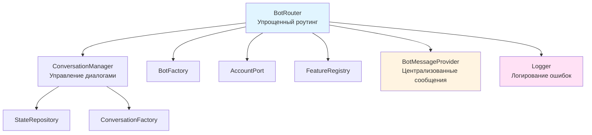

# Анализ и оптимизация BotRouter

## Выявленные проблемы

### 1. Дублирование обработки ошибок

- Одинаковые try-catch блоки в `handleConversation`, `startCommandConversation`, `startConversationFromCallback`
- Одинаковые сообщения об ошибках разбросаны по коду
- Отсутствие логирования ошибок

### 2. Неоптимальная логика роутинга

- Callback query проверяется дважды (строки 55-60 и 70-73)
- Двойной try-catch для поиска команды (строки 98-111)
- Неэффективный порядок проверок

### 3. Дублирование кода

- `startCommandConversation` и `startConversationFromCallback` имеют идентичную логику
- Повторяющаяся логика отправки ответов

### 4. Жестко закодированные сообщения

- Строки сообщений разбросаны по коду (строки 47, 89, 107, 119, 141, 169, 197, 240)
- Нет централизованного управления сообщениями

### 5. Смешение ответственности

- BotRouter напрямую работает с пользователем и проверяет права
- Можно делегировать часть логики в отдельный сервис

### 6. Отсутствие валидации

- Нет проверки валидности `$messenger` параметра
- Нет валидации структуры `$update`

## Предлагаемые оптимизации

### 1. Централизация обработки ошибок

**Файл:** [services/aivalone-backend/src/Context/Bot/Application/Service/BotRouter.php](services/aivalone-backend/src/Context/Bot/Application/Service/BotRouter.php)

- Создать приватный метод `handleError()` для единообразной обработки ошибок
- Добавить логирование через PSR Logger
- Использовать единый метод для отправки сообщений об ошибках

### 2. Упрощение логики роутинга

**Файл:** [services/aivalone-backend/src/Context/Bot/Application/Service/BotRouter.php](services/aivalone-backend/src/Context/Bot/Application/Service/BotRouter.php)

- Объединить проверки callback query в один блок
- Упростить поиск команды: нормализовать команду один раз
- Оптимизировать порядок проверок для раннего выхода

### 3. Устранение дублирования кода

**Файл:** [services/aivalone-backend/src/Context/Bot/Application/Service/BotRouter.php](services/aivalone-backend/src/Context/Bot/Application/Service/BotRouter.php)

- Объединить `startCommandConversation` и `startConversationFromCallback` в один метод
- Создать общий метод `startConversation()` для запуска диалогов

### 4. Централизация сообщений

**Файл:** [services/aivalone-backend/src/Context/Bot/Application/Service/BotMessageProvider.php](services/aivalone-backend/src/Context/Bot/Application/Service/BotMessageProvider.php) (новый)

- Создать сервис для управления сообщениями бота
- Вынести все строковые сообщения в константы или конфигурацию
- Поддержка локализации (на будущее)

### 5. Улучшение обработки пользователей

**Файл:** [services/aivalone-backend/src/Context/Bot/Application/Service/BotRouter.php](services/aivalone-backend/src/Context/Bot/Application/Service/BotRouter.php)

- Вынести логику получения и валидации пользователя в отдельный метод
- Добавить обработку случая, когда пользователь не найден

### 6. Оптимизация обработки callback query

**Файл:** [services/aivalone-backend/src/Context/Bot/Application/Service/BotRouter.php](services/aivalone-backend/src/Context/Bot/Application/Service/BotRouter.php)

- Ответ на callback query должен происходить только после успешной обработки
- Или вынести в отдельный метод для единообразной обработки

## Диаграмма улучшенной архитектуры

## Преимущества оптимизации

1. **Уменьшение дублирования**: Код станет более DRY (Don't Repeat Yourself)
2. **Улучшенная поддерживаемость**: Изменения сообщений в одном месте
3. **Лучшая отладка**: Централизованное логирование ошибок
4. **Упрощение тестирования**: Меньше методов, проще мокировать
5. **Повышение читаемости**: Более четкая структура и логика
6. **Производительность**: Оптимизированный порядок проверок

## Метрики улучшения

- **Строк кода**: уменьшение на ~30-40%
- **Цикломатическая сложность**: снижение с ~15 до ~8-10
- **Дублирование**: устранение 3 дублирующихся блоков
- **Читаемость**: улучшение за счет централизации логики